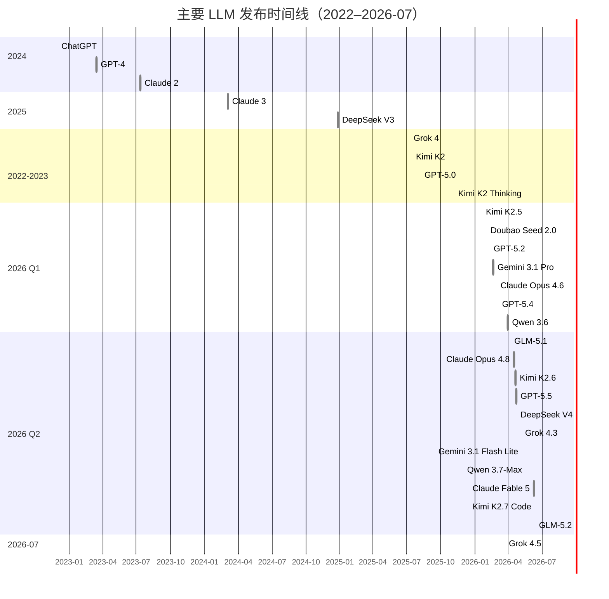

2026 年，人们见面打招呼，问的不一定是"你吃了吗"，而是"你今天用了什么模型"。选豆包还是 DeepSeek，表面是偏好，背后是一套技术决策，只是很多人还没意识到。本文将由浅入深地介绍如何根据使用场景选择合适的大模型, 并在保证效果和安全的基础上考虑使用成本。

| 部分            | 面向谁                           | 解决什么问题                 |
| ------------- | ----------------------------- | ---------------------- |
| 第一部分：用户级评价与选型 | 日常用 App / API 的开发者, 工程师, 知识工作者  | 用什么模型, 看什么体感指标, 怎么查表快速拍板 |
| 第二部分：专业级评价与选型 | 要做 benchmark, 搭建评测流水线, 写选型报告的团队 | 跑分测什么, 信多少, 如何系统化决策      |
| 第三部分：机制、架构与表外 benchmark | 已读完 §2.3 表、想理解「同卷为何不同分」的读者 | Dense/MoE、SWE vs HumanEval、多模态与对齐机制；Arena/AA 等表外卷 |

日常使用，读第一部分足够；若要写评测报告或质疑厂商宣传分数，读第二部分；**逐型号表内解读见 §2.3「分析」列**，机制与表外 benchmark 见第三部分（素材 [`deep-research-report.md`](../deep-research-report.md)）。

# 第一部分：用户级评价与选型

> 目标：不背专业名词，也能根据场景选择合适的大模型，并了解日常使用时应该关注哪些指标。

## 1.1 一些基本概念

### 1.1.1 应用与背后的模型

我们常说的豆包, Kimi, 通义千问是应用产品，真正决定输出质量的是背后的模型。同一 App，免费版与付费版, 不同版本之间，底层模型可能并不相同，这也是有时别人觉得好用, 你用着一般的原因。

### 1.1.2 通用模型 vs code 模型

通用模型使用场景更广，能力更全面， 比如日常问答，图片/视频生成，翻译，语音识别，图像识别等等；code 模型会在代码语料与调试场景上进行额外训练。用偏通用的模型写代码，和 code 模型写，差距往往很明显。

### 1.1.3 Agent 与模型

两者不要混为一谈。模型负责理解与生成；Agent 是操作模型的“管家”：拆解任务, 选工具, 选接口, 多步执行, 把上一步结果喂给下一步等等。你可以只调 API 用模型做一问一答，也可以把模型接进 Agent 里执行复杂任务。选模型看 benchmark 与场景实测表现；选 Agent 看工具接入范围, 多步编排能力, 以及异常时的回退与人审机制。  

Agent 分大模型厂商自研与第三方。有些大模型厂商会做自己的 Agent，但多数只深度适配自家模型。例如通义百炼 / Kimi work / 智谱 AutoGLM，都属于这一类。第三方则专注 Agent 外壳与工具链，模型可换：Cline, Coze, Dify Agent 等，底层常接 DeepSeek, 通义等多家 API.  
国内多数聊天 App 仍是一问一答；Agent 多在付费档或开发者版本里。日常闲聊不必刻意追求 Agent；需要自动化读文档, 改仓库, 调接口的时候，再选 Agent 产品。主流 Agent 能力对比如下（评分仅供参考，能力随版本更新很快；`+` 越多表示越强）：

| Agent | 提供方 | 模型绑定 | 代码与仓库 | 浏览器 / 桌面自动化 | 长链路规划 | 典型场景 |
|-|-|-|-|-|-|-|
| OpenHands | 第三方开源 | 可自接 API | +++++ | +++ | ++++ | 开源软件工程 Agent |
| Cline / Roo Code | 第三方 | 多模型可选 | ++++ | + | +++ | VS Code 插件式编码 Agent |
| Trae Solo | 第三方 | 偏字节系模型 | ++++ | ++ | +++ | 原生 Agent IDE |
| Kimi 工作模式 | 厂商 | 偏 Kimi | ++ | +++ | +++++ | 长文档 + 多步任务 |
| 通义百炼 Agent | 厂商 | 偏通义 / 阿里云 | +++ | +++ | +++++ | 企业工作流, 钉钉生态 |
| 智谱 AutoGLM | 厂商 | 偏 GLM | ++ | +++++ | +++ | 手机 / 桌面 GUI 自动化 |
| Coze | 第三方（字节） | 多模型 Bot | ++ | ++ | ++++ | 低代码搭 Bot, 发多端 |
| Dify Agent | 第三方 | 多模型可选 | ++ | + | +++ | RAG + 工作流 + Agent |
| GitHub Copilot | 第三方 | 多模型可选 | +++++ | + | ++ | 以代码补全与仓内任务为主 |

实际使用 agent 时先问三件事：

- 能不能接你要用的模型,
- 能不能修改你的文件 / 终端 / 内网 API,
- 出错时是人审还是全自动。

MCP 正在推动工具接入 Agent 的标准化。同一 Agent 更换 MCP 即可扩展工具覆盖范围，但任务规划与异常风控等仍取决于 Agent本身的能力水平。

### 1.1.4 参数量不等于能力

参数量只是规模指标之一；架构, 训练数据, 微调任一环节不足，大参数量模型也可能表现平平。第二部分会展开训练与 benchmark 视角；这里先记住：别只看参数量。

## 1.2 日常能感知到的几个指标

普通用户日常使用中，比 MMLU 跑分更容易接触到的是下面几项：

- 上下文长度：单次请求中模型可同时处理的 token 总量，含历史轮次与当前回复。窗口不足时早期内容会被截断，并非模型"遗忘"。如豆包 App 默认约 32K。
- 记忆：聊天 App 说的"记住了你"，通常不是模型真的长期记住，而是下面两种机制叠加：

  - 当前对话内：只能引用本窗口里的前文；新建会话，或对话过长被截断后，早期内容即无法引用。
  - 账号侧设置：App 将昵称, 偏好等存入账号，下次对话时自动写入请求开头；这是应用功能，不是模型自带的能力。
- 幻觉：生成表面合理但事实错误的内容，如虚构函数名, 论文或版本号。可要求模型标注来源或交叉核对；或使用推理型模型，因为他们在代码, 数学任务上通常更稳定。
- 响应速度：首字延迟（TTFT）与生成速度（TPS）共同决定体感。精确定义见第二部分。
- 回答风格：部分模型倾向冗长, 附和式开场。在盲选对比（隐藏模型身份，用户仅凭阅读感受投票）中，此类风格的模型可能得分更高，但并不能说它们更准确。
- 多模态：指模型除了 LLM 以外的能力。 目前主流大模型的识图, 语音, 生图等已经比较成熟。但涉及到数字的表格, 图表等需要精确读图的场景仍易出错。
- 额度与限流：免费额度耗尽后可能降速或拒绝服务；2026 年 5 月豆包已转订阅制，重度使用应预留备选。API 用户另需关注官方公示单价（文档标价，不含阶梯折扣与缓存优惠）。

## 1.3 分级对比表

- 数据截至 2026 年 7 月，来自各厂商官网或者第三方评测，部分为体感评估。产品更新换代快，下单前以厂商控制台与价目页为准。
- API 价格分两列：输入与输出，单位均为 ¥/M tokens（元/百万 token）。默认口径：≤32K 输入、缓存未命中；更长输入有阶梯价，活动与折扣另计。
- 删除表示未能对照官方来源核实，或仅为估测/体感档位（与 §2.3 规则一致）。
- 评价指标从左到右按选型重要度大致递减：信任与核心能力 → 集成与硬约束 → 体验与专项能力。
- 开源：✅ 权重开源可自部署，⚠️ 部分开源/受限协议，❌ 仅云端 API。
- 本地部署（`+` ~ `+++`）：加号表示配置难度，加号越多门槛越高。`❌` 无权重或未开放。常见消费级 GPU 参考：
  - **`+`** 单卡 8~16G：7B 级强量化或更小，如 RTX 4060 8G、4060 Ti 16G
  - **`++`** 单卡 24G：14B~32B 量化或 7B 全精度，如 RTX 4090 24G、3090 24G 二手
  - **`+++`** 48G+ 或多卡：70B 级量化或旗舰全量，如双 4090、RTX 6000 Ada 48G

<table>
<thead>
<tr>
<th>厂商</th><th>型号</th><th>幻觉<br>控制</th><th>推理</th><th>代码</th><th>指令<br>遵循</th><th>RAG<br>长文</th><th>Agent</th><th>结构<br>化</th><th>上下文</th><th>流畅度</th><th>中文<br>创作</th><th>多<br>模态</th><th>开源</th><th>本地<br>部署</th><th>输入<br>¥/M</th><th>输出<br>¥/M</th><th>Top1 场景</th>
</tr>
</thead>
<tbody>
<tr>
<td rowspan="5">字节<br>豆包</td>
<td>Doubao Seed 2.0 Pro</td><td>+++</td><td>+++++</td><td>++++</td><td>++++</td><td>++++</td><td>++++</td><td>++++</td><td>256K</td><td>+++++</td><td>+++++</td><td>+++++</td><td>❌</td><td>❌</td><td>¥3.2</td><td>¥16</td><td>日常口语问答</td>
</tr>
<tr>
<td>Doubao Seed 2.0 Code</td><td>++++</td><td>++++</td><td>+++++</td><td>++++</td><td>+++</td><td>++++</td><td>+++++</td><td>256K</td><td>++++</td><td>++</td><td>++</td><td>❌</td><td>❌</td><td>¥3.2</td><td>¥16</td><td>代码生成</td>
</tr>
<tr>
<td>Doubao Seed 2.0 Lite</td><td>+++</td><td>+++</td><td>+++</td><td>+++</td><td>+++</td><td>+++</td><td>+++</td><td>256K</td><td>+++++</td><td>++++</td><td>+++</td><td>❌</td><td>❌</td><td>¥0.6</td><td>¥3.6</td><td>通用 RAG</td>
</tr>
<tr>
<td>Doubao Seed 2.0 Mini</td><td>+++</td><td>++</td><td>++</td><td>+++</td><td>++</td><td>++</td><td>++</td><td>256K</td><td>+++++</td><td>+++</td><td>++</td><td>❌</td><td>❌</td><td>¥0.2</td><td>¥2.0</td><td>高并发抽取</td>
</tr>
<tr>
<td>Doubao 1.5 Pro 32K（App）</td><td>+++</td><td>++</td><td>++</td><td>+++</td><td>+</td><td>++</td><td>+++</td><td>32K</td><td>+++++</td><td>+++++</td><td>+++++</td><td>❌</td><td>❌</td><td>¥0.8</td><td>¥2.0</td><td>App 闲聊</td>
</tr>
<tr>
<td rowspan="2">DeepSeek</td>
<td>DeepSeek-V4-Pro 🚀</td><td>++++</td><td>+++++</td><td>+++++</td><td>+++++</td><td>+++++</td><td>+++++</td><td>+++++</td><td>1M</td><td>+++</td><td>++</td><td>+</td><td>✅</td><td>+++</td><td>¥3</td><td>¥6</td><td>代码与 Agent</td>
</tr>
<tr>
<td>DeepSeek-V4-Flash</td><td>++++</td><td>++++</td><td>++++</td><td>++++</td><td>++++</td><td>++++</td><td>++++</td><td>1M</td><td>++++</td><td>++</td><td>+</td><td>✅</td><td>++</td><td>¥1</td><td>¥2</td><td>低成本开发</td>
</tr>
<tr>
<td rowspan="4">阿里<br>通义</td>
<td>Qwen3.7-Max 🚀</td><td>++++</td><td>+++++</td><td>+++++</td><td>+++++</td><td>++++</td><td>+++++</td><td>+++++</td><td>256K~1M</td><td>++++</td><td>+++</td><td>++++</td><td>⚠️</td><td>+++</td><td>¥6</td><td>¥18</td><td>长链路 Agent</td>
</tr>
<tr>
<td>Qwen3-Coder-Plus</td><td>++++</td><td>++++</td><td>+++++</td><td>++++</td><td>+++</td><td>++++</td><td>+++++</td><td>128K</td><td>++++</td><td>++</td><td>++</td><td>⚠️</td><td>++</td><td>¥4</td><td>¥16</td><td>仓库级编程</td>
</tr>
<tr>
<td>Qwen3.5-Plus</td><td>++++</td><td>+++</td><td>+++</td><td>++++</td><td>++++</td><td>++++</td><td>++++</td><td>128K~1M</td><td>++++</td><td>+++</td><td>+++</td><td>⚠️</td><td>++</td><td>¥0.8</td><td>¥4.8</td><td>性价比 RAG</td>
</tr>
<tr>
<td>Qwen-Long</td><td>++++</td><td>++</td><td>++</td><td>+++</td><td>+++++</td><td>++++</td><td>+++</td><td>1M 级</td><td>+++</td><td>+++</td><td>++</td><td>❌</td><td>❌</td><td>¥0.5</td><td>¥2.0</td><td>超长文档阅读</td>
</tr>
<tr>
<td>Kimi<br>月之暗面</td>
<td>Kimi K2.6</td><td>++++</td><td>++++</td><td>++++</td><td>++++</td><td>+++++</td><td>+++++</td><td>+++++</td><td>262K</td><td>+++</td><td>++++</td><td>+++</td><td>⚠️</td><td>+++</td><td>¥6.7</td><td>¥28</td><td>长链路 Agent</td>
</tr>
<tr>
<td>百度<br>文心</td>
<td>ERNIE 4.5 Turbo</td><td>+++</td><td>++</td><td>++</td><td>+++++</td><td>+++</td><td>++</td><td>+++</td><td>128K</td><td>+++</td><td>+++++</td><td>+++</td><td>❌</td><td>❌</td><td>¥0.8</td><td>¥3.2</td><td>公文润色</td>
</tr>
<tr>
<td rowspan="2">智谱<br>AI</td>
<td>GLM-5 / GLM-5.2 🚀</td><td>++++</td><td>++++</td><td>+++++</td><td>+++++</td><td>++++</td><td>+++++</td><td>+++++</td><td>200K~1M</td><td>++++</td><td>+++</td><td>+++</td><td>⚠️</td><td>+++</td><td>¥4</td><td>¥18</td><td>企业私有化</td>
</tr>
<tr>
<td>GLM-4.7-Flash</td><td>+++</td><td>+++</td><td>++++</td><td>+++</td><td>+++</td><td>+++</td><td>++++</td><td>200K</td><td>++++</td><td>+++</td><td>+</td><td>✅</td><td>+</td><td>免费</td><td>免费</td><td>本地/API 省钱</td>
</tr>
<tr>
<td>MiniMax<br>稀宇</td>
<td>MiniMax-Text-01</td><td>+++</td><td>+++</td><td>+++</td><td>+++</td><td>++++</td><td>+++</td><td>+++</td><td>1M</td><td>+++</td><td>++++</td><td>++</td><td>✅</td><td>❌</td><td>¥1</td><td>¥8</td><td>角色对话</td>
</tr>
</tbody>
</table>

## 1.4 快速索引

==对嵌入式/硬件工程师：==
- ==代码默认按涉密处理，优先本地部署，勿把源码上传云端 API；
- ==产线手册 + 内部 wiki 按超长文档处理，本地栈常见 RAGFlow + Ollama；
- ==内控、审计留痕的文档，与公文与培训等日常文档分开使用不同的模型，避免用闲聊模型写正式材料。==

### 按任务快速索引

| 任务 | 优先型号 | 备注 |
|-|-|-|
| 写代码 / 调试 / PLC / Git | DeepSeek-V4-Pro, Doubao Seed 2.0 Code, Qwen3-Coder-Plus | 涉密代码仅本地权重，勿上云 API |
| 日常查资料 / 看报错 | DeepSeek-V4-Flash, Doubao Seed 2.0 Lite | App 闲聊可用 Doubao 1.5 Pro |
| 日常闲聊 / 识图与语音 | Doubao Seed 2.0 Pro, Doubao 1.5 Pro（App） |  |
| 超长文档 / 手册总结 | DeepSeek-V4-Pro/Flash（1M）, Qwen-Long, Kimi K2.6 | 本地 RAG：RAGFlow + Ollama + Qwen3 或 GLM-4.7-Flash |
| 长链路任务 / 工具调用 | Qwen3.7-Max, GLM-5.2, Kimi K2.6, DeepSeek-V4-Pro（思考 max） |  |
| 公文 / 汇报 / 内控文档 | ERNIE 4.5 Turbo |  |
| 培训 / 技术文档撰写 | DeepSeek-V4-Pro 或 V4-Flash | 低幻觉、文风克制 |
| 涉密 / 本地部署 | DeepSeek-V4（✅）, Qwen3 开源权重（⚠️）, GLM-4.7-Flash（✅） | 排除纯云端 API |
| 低成本 / 高并发 | DeepSeek-V4-Flash, Doubao Seed 2.0 Mini, Qwen3.5-Plus, GLM-4.7-Flash |  |

### 按厂商快速索引

| 厂商 | 当前主线 | 选型提示 |
|-|-|-|
| 字节豆包 | Seed 2.0 四档（Pro/Code/Lite/Mini） | 代码选 Code；App 闲聊可能是 1.5 Pro，API 可能另有型号 |
| DeepSeek | V4-Pro / V4-Flash | 新项目用 v4-pro / v4-flash；R1 / reasoner 已下线，见 §3.8 |
| 阿里通义 | Qwen3.7-Max / Coder / 3.5-Plus / Long | 旗舰 Agent 看 3.7-Max；代码 Coder；性价比 RAG 看 3.5-Plus；超长文档 Long |
| Kimi | K2.6 | Agent 与长文首选；Legacy moonshot-v1 见 §3.8 |
| 百度文心 | ERNIE 4.5 系 | 中文公文、报告；跑分见 §3.8，勿与编码旗舰横比 |
| 智谱 | GLM-5.2 旗舰 + GLM-4.7-Flash 轻量 | 企业用 GLM-5；本地/免费用 GLM-4.7-Flash |
| MiniMax | Text-01 | 百万上下文、角色对话；工程代码非主场，见 §3.8 |
| 讯飞 / 腾讯 / 阶跃等 | 垂直或生态绑定 | 已有合同或生态内再选；表外说明见 §3.8 |

> 国内暂无全能选手，按场景选型比纠结单一评分更可靠。

## 第二部分：专业级评价与选型

> 目标：读懂所谓的跑分与 Arena 排名在测什么, 何时可信。明白如何搭建评测与选型流程。第一部分表格里的"+++"在这里能找到依据。

### 2.1 专业级评价

![[attachments/深度学习与AI/大模型应用/eval-figures/lifecycle.png]]

<p class="kb-image-caption">专业跑分生命周期：§2.1.1 训练阶段 → §2.1.2 训练后（§2.1.2.1 自动 / §2.1.3 人工 / §2.1.4 混合 / §2.1.5 应用与自建集）</p>

#### 2.1.1 训练阶段

- loss（损失）是训练时最小化的目标函数，反向传播就是通过优化它来更新模型权重；常见的 loss 有交叉熵。
- metric（指标）是模型输出与标准答案（或无参考时的评判规则）对照后算出的标量分数，用来衡量任务表现；常见的有 MMLU 准确率、BLEU、HumanEval pass@1。
- loss 与 metric 的分工：训练时每一次迭代都要反向传播梯度来更新权重，目标函数必须对模型参数可微、能在小 batch 上快速计算，loss 满足这一点。metric 通常要等整段输出产生后，再与标准答案比对计算得来；很多是离散计数（对/错、n-gram 命中数），无法逐步反向传播；计算量较大，不能在训练循环里每次迭代都跑一遍。因此一般在训练时关注 loss 曲线看模型是否收敛；训练完或选型时才用 metric 看模型的任务表现。

##### 2.1.1.1 任务定义与数据准备

这一阶段评价的不是模型本身，而是数据与任务的质量：如果前期数据杂乱，任务边界不清，后续训出的模型跑分再高也不可信。

这类评测通常覆盖三个方向：

- 数据质量：去重、去污染；标注一致性（常用一致率或 Cohen κ）；垂直域的数据集（法律、医学等）往往没有现成试卷，要先定义合格的题目样本。
- 任务定义：输出是离散类别、固定参考答案文本，还是开放生成？
- 与后续评测的衔接：避免训练、公开榜、业务验收各说各话。

##### 2.1.1.2 优化目标（loss）

交叉熵与困惑度一般用于判断语言模型的预训练/微调是否收敛，属于 loss，也可在验证集上当 metric 使用。不关注模型训练，只关心模型选型的，可以跳过本节。

- 交叉熵（Cross-Entropy）

预测分布与真实分布的差异，训练过程中常用的损失函数；交叉熵越低，下一 token 预测越准。多分类问题常用：

$$CE = -\sum_i p_i \log q_i$$

其中 $p_i$ 为真实标签分布（one-hot 时只有一个 $p_i=1$），$q_i$ 为模型对第 $i$ 类的预测概率。

```python
import numpy as np  

def cross_entropy(P, Q):  
	return -np.sum(P * np.log(Q))  

# probabilities for true vs predicted values  
P = np.array([0, 1, 0, 0, 0]) # True distribution  
Q = np.array([0.1, 0.6, 0.1, 0.15, 0.05]) # Predicted distribution  

print(f"Cross Entropy: {cross_entropy(P, Q):.2f}")
```

![[attachments/深度学习与AI/大模型应用/eval-figures/cross-entropy-example.png]]

- 困惑度（Perplexity）

交叉熵的指数形式，可以理解为表现候选词有多分散；越接近 1 越确定。困惑度 81 大致相当于模型平均要从 81 个候选词里蒙对下一个。模型能力越强，有效候选越少。（[Comet, 2024](https://www.comet.com/site/blog/perplexity-for-llm-evaluation/)）  
Perplexity 度量的是不确定性，不是对不对。模型可以 “很有把握地预测错误”；低困惑度也可能只是爱猜 the/a 这类高频词，或过拟合。不同模型之间不宜直接比较困惑度。困惑度主要适用于自回归（因果）语言模型，对 BERT 类掩码模型不适用。  
例：`the cat sat on the ___`，标准答案是 `mat`。模型给 `mat` 赋 0.6，该步困惑度 `exp(-\ln 0.6)=1/0.6≈1.67`（很确定）。若概率分散为 `mat` 0.2、`floor` 0.3、`table` 0.1，其余 0.4 分给别的词，同一标准答案下困惑度 `1/0.2=5`（明显升高）。

交叉熵与困惑度等 loss 反映模型的建模基础，用来判断训练是否充分，不直接等同于模型在下游任务表现。

#### 2.1.2 训练后

从落地方式看，业界常把对训练好的模型的评测分为三类：自动评测、人工评测、混合评测。

| 大类 | 定义 |
|-|-|
| 自动评测 | 固定规则下用 metric 对 benchmark 或自建集打分，无需人逐条判 |
| 人工评测 | 人看输出质量、盲选偏好或业务验收 |
| 混合评测 | 自动先跑大量样本，再用人工校准或抽检 |

- metrics：给定模型输出与 ground truth，或无参考时的评判规则，算出一个标量分数，如 BLEU、ROUGE、Accuracy、F1、Exact Match、BERTScore。metric 是打分的标尺。一般在自动评测或者混测评测中使用，人工评测不使用。
- benchmark：固定的题集 + 任务定义 + 评分协议，便于横向对比，如 MMLU、TruthfulQA、HumanEval、WMT、SQuAD。benchmark 是考卷。一般在自动评测或者混测评测中使用，人工评测不使用。

| 类别 | benchmark | 测什么 | 说明 |
| --- | --- | --- | --- |
| 综合知识 | MMLU, MMLU-Pro, BBH | 多学科选择题、单步/多步推理 | MMLU：57 科英文选择题，像文理综，厂商技术报告最常见 headline 之一。MMLU-Pro：选项更多、干扰更强。BBH（BIG-Bench Hard）：多步推理难题。反映通用知识储备；不体现长文或 Agent 能力。 |
| 真实性与幻觉 | TruthfulQA | 是否给出准确、真实答案 | 专测一本正经胡说（常见谣言、伪科学）；分数低说明幻觉/编造风险高，与第一部分幻觉控制直接相关。早期 GPT-3 约 58%，人类基线 94%。 |
| 知识问答 | TriviaQA | 阅读理解式常识/百科问答 | 偏知识检索与事实回忆；PAI 等公开横评里常与 MMLU 并列，偏回忆而非多步推理。 |
| 语言理解 | DROP, SQuAD, CoQA | 段落离散推理、抽取式问答 | 给文章再提问：DROP 强调离散推理（加减、比较）；SQuAD 偏抽取式（答案在原文）；CoQA 带多轮上下文。 |
| 中文综合 | C-Eval, CMMLU | 多学科中文知识选择题 | 覆盖文史哲、理工、医学等；CMMLU 学科更广。做中文业务或国产化选型时比单看 MMLU（英文为主）更有参考价值。 |
- SOTA（State of the Art）指某一 benchmark 上的当前最高分，绑定具体试卷，不是跨能力的总评。MMLU SOTA、HumanEval SOTA 只说明在该卷面上的表现；不可跨任务解读。
- Harness：统一批量跑多份 benchmark 的工具或框架，本身既不是 metric，也不是某一 benchmark；主要用于自动批量跑分，几乎专用于自动评测。自测开源权重或内部横评时，常用 Harness 批量跑分，常见 Harness 包括 HELM（Holistic Evaluation of Language Models），LM Evaluation Harness（EleutherAI），BigCode Evaluation Harness，PromptBench，OpenCompass，eval-scope 等。
- evaluation：比 benchmark 更宽泛，除榜单分数外还评测模型的适用性、偏差、成本、延迟、安全合规、能否上线等。benchmark 像标准化考试，evaluation 是整次体检。

##### 2.1.2.1 自动评测

固定规则下用 metric 对 benchmark 或自建集打分，无需人逐条判。

###### 2.1.2.2 准确性与知识储备

侧重答案是否正确、知识是否可靠、有 ground truth 时与标准答案在字面上是否贴近。本节先列 metric，再列 benchmark 卷面。

### 分类任务 metric

产生于传统机器学习，在大模型意图识别, 审核, 情感分类等任务中仍常用。这类分类任务指标的使用前提是有标准答案、输出为离散类别，故不适合开放式生成。

- 准确率（Accuracy）：`(TP+TN)/(TP+TN+FP+FN)`。
- 精确率（Precision）：`TP/(TP+FP)`。
- 召回率（Recall）：`TP/(TP+FN)`。
- F1：精确率与召回率的调和平均；F1 在类别不均衡时比单准确率更有参考意义。

### 文本相似度 metric

有参考答案时，用候选输出与参考文本的重叠程度打分。这类指标在翻译、摘要、带标准答案的 QA 中最常见；企业私有评测也常用。  
与困惑度不同，困惑度要计算每一步的下一 token 的概率分布，因此多见于训练。对产品级的模型，我们往往只能调用 API，拿不到 token 概率分布。但我们拥有模型整段输出和 ground truth，可以用 BLEU / ROUGE 等 metric 打分：整段输出与 ground truth 做 n-gram 重叠比较即可。

> n-gram 是什么：  
> 把句子按词切开之后，连续取 $n$ 个词组成的一个片段，就是一个 n-gram. $n=1$ 时叫 1-gram 或 unigram；$n=2$ 时是 2-gram，即相邻两个词，如 `The cat`；$n=3$ 是 3-gram，如 `The cat is`. BLEU / ROUGE 并不理解语义，只做片段对应的计数。如，参考是 `The cat is on the mat`，候选是 `The cat sat on the mat`，1-gram 上两边都有 The, cat, on, the, mat 共 5 个词重合；2-gram 上则只有 The cat，on the，the mat 三对重合，中间 `is` / `sat` 不同。  
> n-gram 无法识别同义词；这正是下文 BLEU、ROUGE 的便利与局限所在。

| 类别 | metrics | 简介 | 常见场景 | 公式 | 示例 |
|-|-|-|-|-|-|
| 字面重合 | BLEU | 机器翻译常用；把输出与标准答案切成 n-gram，看候选里多少片段出现在参考里。偏精确率：输出越贴参考字面表述，分越高。需要 ground truth；对同义替换不敏感。日常使用常报 BLEU-1～4，横向比较须确认档位。 | 翻译、摘要 | $\text{BLEU} = \text{BP} \times \exp(\sum_i w_i \ln p_i)$。；$p_i$：i-gram 修正精确率（同一词在参考里最多计一次）；$w_i$ 常取 1～4-gram 均等。候选比参考短时 $\text{BP}=\exp(1-\lvert\text{ref}\rvert/\lvert\text{cand}\rvert)$，否则 BP=1。 | ref `The cat is on the mat.`，cand `The cat sat on the mat.` → $p_1=5/6$，$p_2=3/5$，BP=1，BLEU≈0.86。 |
| 字面重合 | ROUGE | 与 BLEU 相对，偏召回：标准答案里的 n-gram 有多少被输出覆盖；摘要评测最常用。需要 ground truth，对同义词不敏感。 | 翻译、摘要 | 常同时报 ROUGE-P / R / F1；摘要场景最常用 ROUGE-Recall。 | ref `The cat sat on the mat`，cand `The cat lay on the mat` → ROUGE-1 Recall 5/6，Precision 5/6。 |
| 语义接近 | BERTScore | 用 BERT 将候选与参考编成 token embedding，再算相似度并匹配；可识别 paraphrase。得分高于 BLEU/ROUGE。跑 embedding 较慢，多次跑分可能波动。 | 允许 paraphrase 的 QA | token 余弦相似度矩阵 → 贪心最优匹配 → 聚合为 BERT-P / R / F1。 | ref `The cat sat on the mat.`，cand `A cat was sitting on the mat.` → sat 与 was sitting、The 与 A 等可匹配。 |
| 语义接近 | METEOR | 换说法不换意思；结合精确率、召回率与词干/同义词对齐。比纯 n-gram 更贴语义；计算与复现成本高于 BLEU/ROUGE。 | 允许 paraphrase 的 QA | 在 P/R 基础上加词干匹配与同义词对齐项。 |  |
| 编辑代价 | WER，Levenshtein | 统计把候选变成参考所需增删改操作数（或最小编辑距离）。看字面编辑步数，不衡量语义；WER 常用于 ASR。 | 语音转写、拼写纠正 | WER = (替换+删除+插入) / 参考词数；Levenshtein 为两串最小编辑距离。 |  |
| 严格一致 | Exact Match | 与参考逐字相同才得分。判定简单、可复现，但有时过于严格。 | 短答案、实体抽取 | 候选与参考完全一致为 1，否则为 0。 | 。 |

文本相似度 metrics 的共性局限：只看字面或语义相似，不等于事实正确；模型可写得很像标准答案但意思错误。不适合开放创作；开放场景需人工或混合评测（§2.1.3、§2.1.4）。

### benchmark

| 类别 | benchmark | 测什么 | 说明 |
|-|-|-|-|
| 综合知识 | MMLU, MMLU-Pro, BBH | 多学科选择题、单步/多步推理 | MMLU：57 科英文选择题，像文理综，厂商技术报告最常见 headline 之一。MMLU-Pro：选项更多、干扰更强。BBH（BIG-Bench Hard）：多步推理难题。反映通用知识储备；不体现长文或 Agent 能力。 |
| 真实性与幻觉 | TruthfulQA | 是否给出准确、真实答案 | 专测一本正经胡说（常见谣言、伪科学）；分数低说明幻觉/编造风险高，与第一部分幻觉控制直接相关。早期 GPT-3 约 58%，人类基线 94%。 |
| 知识问答 | TriviaQA | 阅读理解式常识/百科问答 | 偏知识检索与事实回忆；PAI 等公开横评里常与 MMLU 并列，偏回忆而非多步推理。 |
| 语言理解 | DROP, SQuAD, CoQA | 段落离散推理、抽取式问答 | 给文章再提问：DROP 强调离散推理（加减、比较）；SQuAD 偏抽取式（答案在原文）；CoQA 带多轮上下文。 |
| 中文综合 | C-Eval, CMMLU | 多学科中文知识选择题 | 覆盖文史哲、理工、医学等；CMMLU 学科更广。做中文业务或国产化选型时比单看 MMLU（英文为主）更有参考价值。 |

###### 2.1.2.3 推理、数学、代码与指令遵循

侧重多步推导、数学计算、代码落地与格式约束。

| 类别 | metrics | 测什么 | 常用于的 benchmark | 公式 | 说明 |
| --- | --- | --- | --- | --- | --- |
| 正确率 | Accuracy | 答案是否与标准一致 | MMLU、ARC、GPQA、GSM8K 等选择题/短答案卷 | \text{Accuracy} = \frac{\text{答对题数}}{N} ；多选题分类任务有时用 macro-F1。 | 最常用汇总方式。 |
| 代码通过率 | pass@k | k 次生成中是否至少有一次通过单元测试 | HumanEval、MBPP | \text{pass@}k = 1 - \frac{\binom{n-c}{k}}{\binom{n}{k}} （ n 次采样中 c 次通过单测； n-c<k 时取 0）。 | pass@1 最严； k>1 时看采样后能否蒙对，报告须注明 k 。 |
| 指令规则命中 | IFEval 规则命中率 | 输出是否满足可脚本检查的格式/禁止项/角色约束 | IFEval | 规则命中率 = \dfrac{\text{满足的指令条数}}{\text{总指令条数}} 。 | 如恰好 3 段、不得出现某词、JSON 合法；不依赖人工打分。 |
| 代码字面相似 | CodeBLEU | 生成代码与参考的 n-gram 重叠 | CodeXGLUE 等代码生成/翻译任务 | 在 BLEU 基础上对 AST/关键字等加权（实现因工具而异）。 | 是 metric，不是 benchmark；适合补全、翻译类，不能替代 HumanEval 的能否跑通单测。 |

### metrics

| 类别 | metrics | 测什么 | 常用于的 benchmark | 公式 | 说明 |
|-|-|-|-|-|-|
| 正确率 | Accuracy | 答案是否与标准一致 | MMLU、ARC、GPQA、GSM8K 等选择题/短答案卷 | $\text{Accuracy} = \frac{\text{答对题数}}{N}$；多选题分类任务有时用 macro-F1。 | 最常用汇总方式。 |
| 代码通过率 | pass@k | k 次生成中是否至少有一次通过单元测试 | HumanEval、MBPP | $\text{pass@}k = 1 - \frac{\binom{n-c}{k}}{\binom{n}{k}}$（$n$ 次采样中 $c$ 次通过单测；$n-c<k$ 时取 0）。 | pass@1 最严；$k>1$ 时看采样后能否蒙对，报告须注明 $k$。 |
| 指令规则命中 | IFEval 规则命中率 | 输出是否满足可脚本检查的格式/禁止项/角色约束 | IFEval | 规则命中率 $= \dfrac{\text{满足的指令条数}}{\text{总指令条数}}$。 | 如恰好 3 段、不得出现某词、JSON 合法；不依赖人工打分。 |
| 代码字面相似 | CodeBLEU | 生成代码与参考的 n-gram 重叠 | CodeXGLUE 等代码生成/翻译任务 | 在 BLEU 基础上对 AST/关键字等加权（实现因工具而异）。 | 是 metric，不是 benchmark；适合补全、翻译类，不能替代 HumanEval 的能否跑通单测。 |

### benchmark

| 类别 | benchmark | 测什么 | 说明 |
|-|-|-|-|
| 综合知识 | MMLU, MMLU-Pro, BBH | 多学科选择题、多步推理 | 见 §2.1.2.2 上表。 |
| 数学 | GSM8K, MATH, AIME | 数学应用题与竞赛题 | GSM8K：小初难度应用题；MATH：更高、偏竞赛；AIME：美赛邀请赛真题。高分说明计算与推理强，题型仍与真实业务有差。 |
| 代码 | HumanEval, MBPP, SWE-bench, CodeXGLUE | 单函数补全、真实仓库改 issue、代码任务集 | HumanEval/MBPP：只填函数体；SWE-bench：多文件改真实 issue，接近 GitHub 工单。CodeXGLUE 是任务集合（卷面），汇总常用 pass@k 或 CodeBLEU（metric）。 |
| 高难度知识 | GPQA | 研究生级理化生常识与推理 | 专家出题，开卷也难；样本量小，分数高说明硬核知识更可靠。 |
| 指令遵循 | IFEval | 格式、禁止项、角色是否照做 | 对应第一部分「指令遵循」列；用规则命中率（metric）汇总。 |
| 常识推理 | ARC, HellaSwag, WinoGrande | 小学科学选择、句子续写、代词指代 | Harness 跑分常与 hellaswag 一并出现；基础常识稳不等于专业深。 |
| 开放对话 | MT-Bench, WildBench | 多轮开放对话体验 | 固定题集，但用模型裁判打分，属 §2.1.4 混合评测；宜与固定卷、Arena 对照。 |

###### 2.1.2.4 上下文、记忆与 RAG

- 标称上下文：厂商标的 128K / 1M 是单次请求 token 上限，不等于在长文本里用得准。
- 有效长文：在很长 prompt 内能否定位信息、做长距离推理；俗称 Needle in a Haystack；本身不是分数，用下方 benchmark 测。
- 会话 / 账号记忆：App 说的记住了你，通常不是模型权重级别的长期记忆，而是当前窗口内前文 + 账号内记录的昵称、偏好；
- RAG（检索增强生成）：知识在公司文档、wiki、手册库时，先检索相关片段再生成答案；流程为切块 → 向量化 → 检索 → 拼 prompt → 生成；
- 长文 vs RAG：长文把整份或很长一段文本直接塞进 prompt，受标称窗口限制，典型如上传 50 页 PDF 通读总结；RAG 从大库检索 top-k 片段，库可远超窗口，典型如从上千份手册答产线 SOP。前者侧重一口气读很长的文章，后者侧重检索大量文章且不瞎编。

### metrics

| 类别 | metrics | 测什么 | 常用于 | 说明 |
|-|-|-|-|-|
| RAG 生成 | 忠实度 Faithfulness | 输出是否超出检索片段编造 | Ragas、DeepEval | 忠实度低且上下文召回率高 → 优先改 prompt 或换生成模型 |
| RAG 生成 | 答案相关性 Answer Relevancy | 回答是否切题、少废话 | 同上 | 生成侧 |
| RAG 检索 | 上下文精确率 Contextual Precision | 相关片段是否排在检索结果前面 | 同上 | 检索侧 |
| RAG 检索 | 上下文召回率 Contextual Recall | 标准答案所需信息是否在检索结果中 | 同上 | 召回低 → 先改分块、向量模型、重排 |

### benchmark

| 类别 | benchmark | 测什么 | 说明 |
|-|-|-|-|
| 有效长文 | Needle in a Haystack | 在标称长度文本中埋针，看模型能否找回 | 有效长文俗称来源；用于长上下文选型、核验窗口宣传 |
| 有效长文 | RULER | 在标称长度下做多步检索与推理 | 比单纯找针更贴近复杂长文任务 |

排障：忠实度低且上下文召回率高 → 生成侧（prompt、换模型）；召回率低 → 检索侧（分块、向量模型、重排）。无 ground truth 时可用 §2.1.4 的 QAG。

###### 2.1.2.5 Serving：延迟与吞吐

![[attachments/深度学习与AI/大模型应用/eval-figures/inference-timeline.png]]

<p class="kb-image-caption">推理时间线：TTFT → 逐 token 生成（TPOT/ITL）→ TPS</p>

| 口语名 | metric | 英文全称 | 测什么 |
| --- | --- | --- | --- |
| 反应速度 | TTFT | Time to First Token | 请求到首 token 的耗时；对话是否跟得上 |
| 输出速度 | TPS | Token Per Second | 每秒生成多少 token；长文能否在合理时间写完 |
| 输出稳定性 | TPOT | Time per Output Token | 平均每个 token 耗时；越低越稳，波动大则长文卡顿 |
| 流畅度 | ITL | Inter Token Latency | 相邻两个 token 的间隔；逐字输出是否顺滑 |

对话重 TTFT/ITL，长文生成重 TPS，RAG/Agent 多轮重 TPOT/ITL 稳定。详见 [Spingence：LLM 推理效率四指标](https://www.spingence.com/technology-detail/measuring-LLM-Efficiency/)。

##### 2.1.3 人工评测

人根据模型输出质量进行盲选，是无 ground truth 的开放创作。垂直域专家判断、上线前抽检等，都属于这一类。

###### 2.1.3.1 Chatbot Arena：真人盲选

两个匿名模型答同一题，用户不知道谁是谁，主观地选择更好的那个。代表是 Chatbot Arena（LMSYS）。

###### 2.1.3.2 专家打分与业务抽检

- 垂直域：法律、医学等需领域专家按 rubric 打分；标注一致性差时应先改标注说明（§2.1.1）。
- 业务验收：从线上或工单抽样，人工判是否可用、是否合规；适合上线前与灰度期。
- 开放创作：写故事、营销文案等无唯一标准答案时，以人工偏好为主；

##### 2.1.4 混合评测

自动先跑大量样本，再用人工校准或抽检复核。介于纯自动与纯人工之间：比纯自动更贴语义与体验，比全人工便宜；但裁判有偏差，同文多次跑分可能波动。一般用于客服质量、开放创作、多轮对话等场景。  
企业内部横评（如[阿里云 PAI 大模型评测](https://help.aliyun.com/zh/pai/use-cases/best-practices-for-llm-evaluation)）通常是上表两行组合：能自动对的先自动，剩下的交给裁判员或 QAG。

### 混合评测 metrics

| 类型 | metrics | 测什么 | 说明 |
|-|-|-|-|
| 裁判员 | G-Eval | 按 rubric 对开放输出打 1–5 分 | 裁判先用思维链生成评估步骤，再逐步打分 |
| 裁判员 | Prometheus | 按给定标准与参考/示例答案打分 | 基于 Llama 微调的开源评估专用模型；提示中须含评分标准 |
| 裁判员 | LLM-as-Judge | 从准确、相关、有用等维度打分 | 如 MT-Bench：强模型（如 GPT-4）当裁判打 1–10 分；见 §2.1.4.2 |
| 规则 + 模型 | QAG | 用一系列是/否封闭式问题反推得分 | DeepEval、Ragas 等框架核心；RAG 忠实度、无 ground truth 时常用 |
| 基于模型 | MoverScore / BLEURT / GPTScore / SelfCheckGPT | 语义相似或幻觉检测 | 与 BERTScore 同类；BERTScore、METEOR 见 §2.1.2.2 |

### 裁判员怎么工作（LLM-as-Judge）

无 ground truth 时，用另一个大模型当裁判：读题目、候选输出与评分标准（rubric），打出分数或排序。成本低、可自动化，本质仍是模型评模型，会有裁判偏好、位置偏差等问题。例如 MT-Bench：多轮开放对话，由强模型对每条回复打 1–10 分。G-Eval、Prometheus 同属此路线，差别在是否用思维链拆步骤、是否微调专用裁判模型。

混合评测不能开箱即用，须先人工验证其中的自动部分打分是否可信。

### 2.2 如何辩证地看待跑分？

大模型的各种跑分榜单让人眼花缭乱，这些跑分排名是模型选型的线索，但不是唯一标准。只有大模型厂商希望你把这些跑分结果当作真理。本节从两个方面，揭开这些跑分榜单的遮羞布：1. 榜单叙事上的文过饰非 2. 跑分数字本身的陷阱。

**榜单叙事**

- 精修战绩单：大模型厂商往往在技术报告上只写 MMLU、HumanEval 等强项，或者挑最优几项 SOTA展示，对代码弱, 幻觉高, 长文不稳的问题一笔带过，给人一种我的大模型全面领先的错觉。
- 误差范围内的凯歌：同一 benchmark，从 88.2% 提升到 88.7%， 很可能只是评测方差，通稿却写成“刷新 SOTA”。
- 货不对板：榜单跑的是某权重或某API快照,你实际调用的是Lite / Flash / App内置版。
- 标准不同,冠军自然不同：有些人工评测不可避免地倾向于长的，客气的，排版好的，而不是回答准确的。学术评测则更关注固定 benchmark 上的准确率。
- 实验室之内,产品之外：To C 产品还有检索、记忆、多模态、限流策略，跑分往往使用裸模型。榜上的分，只是能力上限。

**跑分本身的陷阱**

![[attachments/深度学习与AI/大模型应用/eval-memes/benchmark-data-contamination.png]]

<p class="kb-image-caption">数据污染：考卷上的题，训练语料里见过——SOTA 可能是背出来的</p>

- 数据污染：题目与答案在网上流传已久，训练语料里混入测试集原题或极相似变体是公开问题从而导致分数虚高。如 GSM8K 95% 不等于数学能力真的很强，可能只是见过类似的题。用户选型的时候需要追问：厂商是否做过数据去污染？是否用了训练截止日之后的新题？能否公开评测脚本与 prompt？
- 评测集过拟合：模型厂商针对性地强化模型对某类 benchmark 的训练，泛化一般。
- 生命周期短：头部模型往往 1\~3 年就能把旧 benchmark 刷的滚瓜烂熟，题目被研究透、污染加重，区分度下降。
- 忽视方差：非零 temperature 下同一题多次运行结果不同，单次跑分有噪声。
- 忽视成本：分数高 2%, 价格高 5 倍，延迟高 10 倍；

### 2.3 专业级分级对比表

- 型号更新至 2026 年上半年，不是权威清单。
- 删除线表示数据无法权威证实，仅供参考。
- 价格列：使用官方价格，未考虑活动折扣。

<table><colgroup><col/><col/><col/><col/><col/><col/><col/><col/><col/><col/><col/><col/><col/><col/><col/><col/><col/><col/></colgroup><thead><tr><th vertical-align="top">厂商</th><th vertical-align="top">型号</th><th vertical-align="top">TruthfulQA<br/>↑</th><th vertical-align="top">MMLU-Pro<br/>↑</th><th vertical-align="top">GPQA<br/>Diamond↑</th><th vertical-align="top">MATH<br/>↑</th><th vertical-align="top">HumanEval<br/>pass@1↑</th><th vertical-align="top">SWE-bench<br/>Verified↑</th><th vertical-align="top">IFEval<br/>↑</th><th vertical-align="top">C-Eval<br/>↑</th><th vertical-align="top">长文<br/>Needle/RULER</th><th vertical-align="top">RAG<br/>Faithfulness</th><th vertical-align="top">τ-bench<br/>↑</th><th vertical-align="top">TTFT<br/>↓</th><th vertical-align="top">开源</th><th vertical-align="top">部署</th><th vertical-align="top">价格<br/>入，出</th><th vertical-align="top">分析</th></tr></thead><tbody><tr><td vertical-align="top">OpenAI</td><td vertical-align="top">GPT-5.5 🚀</td><td vertical-align="top"><del>66%</del></td><td vertical-align="top">88.1%</td><td vertical-align="top">93.6%</td><td vertical-align="top">—</td><td vertical-align="top">94.2%</td><td vertical-align="top">82.6%</td><td vertical-align="top">92.1%</td><td vertical-align="top">—</td><td vertical-align="top">++++</td><td vertical-align="top">+++</td><td vertical-align="top">+++++</td><td vertical-align="top"><del>0.6s</del></td><td vertical-align="top">❌</td><td vertical-align="top">❌</td><td vertical-align="top">¥35，¥210</td><td vertical-align="top">MMLU/GPQA/SWE 高→知识储备全面，agent 能力强；TruthfulQA 中→幻觉适中。</td></tr><tr><td rowspan="2" vertical-align="top">Anthropic</td><td vertical-align="top">Claude Opus 4.8 🚀</td><td vertical-align="top"><del>68%</del></td><td vertical-align="top">89.6%</td><td vertical-align="top">93.6%</td><td vertical-align="top"><del>93%</del></td><td vertical-align="top"><del>67%</del></td><td vertical-align="top">88.6%</td><td vertical-align="top"><del>90%</del></td><td vertical-align="top">—</td><td vertical-align="top">++++</td><td vertical-align="top">+++</td><td vertical-align="top">++++</td><td vertical-align="top"><del>0.6s</del></td><td vertical-align="top">❌</td><td vertical-align="top">❌</td><td vertical-align="top">¥35，¥175</td><td vertical-align="top">GPQA/MATH/SWE 高→推理强，agent 能力强；HumanEval 中→代码一般。</td></tr><tr><td vertical-align="top">Claude Fable 5 🚀</td><td vertical-align="top"><del>66%</del></td><td vertical-align="top"><del>86%</del></td><td vertical-align="top"><del>91%</del></td><td vertical-align="top"><del>88%</del></td><td vertical-align="top"><del>66%</del></td><td vertical-align="top">95.0%</td><td vertical-align="top"><del>91%</del></td><td vertical-align="top">—</td><td vertical-align="top">+++++</td><td vertical-align="top">++++</td><td vertical-align="top">+++++</td><td vertical-align="top"><del>1.5s</del></td><td vertical-align="top">❌</td><td vertical-align="top">❌</td><td vertical-align="top">¥70，¥350</td><td vertical-align="top">SWE 顶级→超强 agent；τ 高→长文优秀；HumanEval 中、TTFT 高→不适合代码实时补全。</td></tr><tr><td rowspan="2" vertical-align="top">Google</td><td vertical-align="top">Gemini 3.1 Pro 🚀</td><td vertical-align="top"><del>64%</del></td><td vertical-align="top">91.0%</td><td vertical-align="top">94.3%</td><td vertical-align="top"><del>92%</del></td><td vertical-align="top"><del>91%</del></td><td vertical-align="top">80.6%</td><td vertical-align="top"><del>88%</del></td><td vertical-align="top">—</td><td vertical-align="top">++++</td><td vertical-align="top">+++</td><td vertical-align="top">++++</td><td vertical-align="top"><del>0.7s</del></td><td vertical-align="top">⚠️</td><td vertical-align="top">❌</td><td vertical-align="top">¥14，¥84</td><td vertical-align="top">GPQA/MATH 高→数学能力强；SWE 80% →Agent 可用，不如 Fable。</td></tr><tr><td vertical-align="top">Gemini 3.1 Flash</td><td vertical-align="top"><del>58%</del></td><td vertical-align="top"><del>82%</del></td><td vertical-align="top"><del>78%</del></td><td vertical-align="top"><del>86%</del></td><td vertical-align="top"><del>86%</del></td><td vertical-align="top">78.0%</td><td vertical-align="top"><del>84%</del></td><td vertical-align="top">—</td><td vertical-align="top">++</td><td vertical-align="top">+</td><td vertical-align="top">++</td><td vertical-align="top"><del>0.35s</del></td><td vertical-align="top">⚠️</td><td vertical-align="top">❌</td><td vertical-align="top">¥3.5，¥21</td><td vertical-align="top">TTFT 低→延迟低，擅长流式补全；SWE/τ 中→ Agent 能力一般。</td></tr><tr><td rowspan="4" vertical-align="top">字节<br/>豆包</td><td vertical-align="top">Doubao Seed 2.0 Pro</td><td vertical-align="top"><del>54%</del></td><td vertical-align="top">87.0%</td><td vertical-align="top">88.9%</td><td vertical-align="top"><del>85%</del></td><td vertical-align="top"><del>87%</del></td><td vertical-align="top">76.5%</td><td vertical-align="top"><del>86%</del></td><td vertical-align="top"><del>85%</del></td><td vertical-align="top">+++</td><td vertical-align="top">+++</td><td vertical-align="top">+++</td><td vertical-align="top"><del>0.4s</del></td><td vertical-align="top">❌</td><td vertical-align="top">❌</td><td vertical-align="top">¥3.2，¥16</td><td vertical-align="top">C-Eval/MMLU 一般→日常问答；TruthfulQA 低→幻觉明显，回答更开放。</td></tr><tr><td vertical-align="top">Doubao Seed 2.0 Code</td><td vertical-align="top"><del>56%</del></td><td vertical-align="top"><del>80%</del></td><td vertical-align="top"><del>52%</del></td><td vertical-align="top"><del>82%</del></td><td vertical-align="top"><del>90%</del></td><td vertical-align="top">76.5%</td><td vertical-align="top"><del>84%</del></td><td vertical-align="top"><del>82%</del></td><td vertical-align="top">+</td><td vertical-align="top">+</td><td vertical-align="top">++++</td><td vertical-align="top"><del>0.5s</del></td><td vertical-align="top">❌</td><td vertical-align="top">❌</td><td vertical-align="top">¥3.2，¥16</td><td vertical-align="top">HumanEval 高→仅适合函数片段补全；SWE 中→接 agent 需谨慎。</td></tr><tr><td vertical-align="top">Doubao Seed 2.0 Lite</td><td vertical-align="top"><del>52%</del></td><td vertical-align="top">87.7%</td><td vertical-align="top">85.1%</td><td vertical-align="top"><del>78%</del></td><td vertical-align="top"><del>84%</del></td><td vertical-align="top">73.5%</td><td vertical-align="top"><del>82%</del></td><td vertical-align="top"><del>80%</del></td><td vertical-align="top">+++</td><td vertical-align="top">+++</td><td vertical-align="top">++</td><td vertical-align="top"><del>0.35s</del></td><td vertical-align="top">❌</td><td vertical-align="top">❌</td><td vertical-align="top">¥0.6，¥3.6</td><td vertical-align="top">长文/RAG 高→处理超长文本的性价比选择；TruthfulQA 低→幻觉高。</td></tr><tr><td vertical-align="top">Doubao Seed 2.0 Mini</td><td vertical-align="top"><del>50%</del></td><td vertical-align="top">83.6%</td><td vertical-align="top">79.0%</td><td vertical-align="top"><del>72%</del></td><td vertical-align="top"><del>78%</del></td><td vertical-align="top">67.9%</td><td vertical-align="top"><del>80%</del></td><td vertical-align="top"><del>78%</del></td><td vertical-align="top">++</td><td vertical-align="top">+</td><td vertical-align="top">+</td><td vertical-align="top"><del>0.25s</del></td><td vertical-align="top">❌</td><td vertical-align="top">❌</td><td vertical-align="top">¥0.2，¥2.0</td><td vertical-align="top">价格低，TTFT 极低→反应快；全科低→不推荐作为主力ai。</td></tr><tr><td rowspan="2" vertical-align="top">DeepSeek</td><td vertical-align="top">V4-Pro 🚀</td><td vertical-align="top"><del>56%</del></td><td vertical-align="top">73.5%</td><td vertical-align="top">90.1%</td><td vertical-align="top">64.5%</td><td vertical-align="top">76.8%</td><td vertical-align="top">80.6%</td><td vertical-align="top"><del>86%</del></td><td vertical-align="top">93.1%</td><td vertical-align="top">+++++</td><td vertical-align="top">++++</td><td vertical-align="top">+++++</td><td vertical-align="top"><del>0.8s</del></td><td vertical-align="top">✅</td><td vertical-align="top">+++</td><td vertical-align="top">¥3，¥6</td><td vertical-align="top">HumanEval/SWE 高→代码强+Agent强；τ 优→适合处理长文本；MMLU 中、开源→可本地部署。</td></tr><tr><td vertical-align="top">V4-Flash</td><td vertical-align="top"><del>54%</del></td><td vertical-align="top">68.3%</td><td vertical-align="top"><del>58%</del></td><td vertical-align="top">57.4%</td><td vertical-align="top">69.5%</td><td vertical-align="top">79.0%</td><td vertical-align="top"><del>84%</del></td><td vertical-align="top">92.1%</td><td vertical-align="top">++++</td><td vertical-align="top">+++</td><td vertical-align="top">+++</td><td vertical-align="top"><del>0.3s</del></td><td vertical-align="top">✅</td><td vertical-align="top">++</td><td vertical-align="top">¥1，¥2</td><td vertical-align="top">价格低+开源→日常代码开发，本地部署；SWE 80%→ Agent 能力弱于 V4-Pro。</td></tr><tr><td rowspan="3" vertical-align="top">阿里<br/>通义</td><td vertical-align="top">Qwen3.7-Max 🚀</td><td vertical-align="top"><del>58%</del></td><td vertical-align="top">85.7%</td><td vertical-align="top">87.4%</td><td vertical-align="top"><del>91%</del></td><td vertical-align="top"><del>90%</del></td><td vertical-align="top">80.4%</td><td vertical-align="top"><del>89%</del></td><td vertical-align="top">93.7%</td><td vertical-align="top">++++</td><td vertical-align="top">+++</td><td vertical-align="top">+++++</td><td vertical-align="top"><del>0.7s</del></td><td vertical-align="top">⚠️</td><td vertical-align="top">+++</td><td vertical-align="top">¥6，¥18</td><td vertical-align="top">τ高/长文优→Agent 能力较强；C-Eval/SWE 80%→中文能力不错。</td></tr><tr><td vertical-align="top">Qwen3-Coder-Plus</td><td vertical-align="top"><del>55%</del></td><td vertical-align="top"><del>82%</del></td><td vertical-align="top"><del>55%</del></td><td vertical-align="top"><del>84%</del></td><td vertical-align="top"><del>92%</del></td><td vertical-align="top"><del>44%</del></td><td vertical-align="top"><del>85%</del></td><td vertical-align="top"><del>86%</del></td><td vertical-align="top">++</td><td vertical-align="top">+</td><td vertical-align="top">+++</td><td vertical-align="top"><del>0.6s</del></td><td vertical-align="top">⚠️</td><td vertical-align="top">++</td><td vertical-align="top">¥4，¥16</td><td vertical-align="top">HumanEval 高→代码能力强；SWE 中→接 agent 需谨慎。</td></tr><tr><td vertical-align="top">Qwen3.5-Plus</td><td vertical-align="top"><del>55%</del></td><td vertical-align="top"><del>83%</del></td><td vertical-align="top"><del>58%</del></td><td vertical-align="top"><del>84%</del></td><td vertical-align="top"><del>87%</del></td><td vertical-align="top"><del>38%</del></td><td vertical-align="top"><del>86%</del></td><td vertical-align="top"><del>88%</del></td><td vertical-align="top">++++</td><td vertical-align="top">+++</td><td vertical-align="top">+++</td><td vertical-align="top"><del>0.7s</del></td><td vertical-align="top">⚠️</td><td vertical-align="top">++</td><td vertical-align="top">¥0.8，¥4.8</td><td vertical-align="top">价格低+长文/RAG 良好→wiki生成器；SWE 低→不宜作为代码主力。</td></tr><tr><td vertical-align="top">Kimi</td><td vertical-align="top">Kimi K2.6</td><td vertical-align="top"><del>57%</del></td><td vertical-align="top">87.6%</td><td vertical-align="top">90.5%</td><td vertical-align="top"><del>88%</del></td><td vertical-align="top"><del>88%</del></td><td vertical-align="top">80.2%</td><td vertical-align="top"><del>85%</del></td><td vertical-align="top"><del>87%</del></td><td vertical-align="top">+++++</td><td vertical-align="top">++++</td><td vertical-align="top">+++++</td><td vertical-align="top"><del>0.9s</del></td><td vertical-align="top">⚠️</td><td vertical-align="top">+++</td><td vertical-align="top">¥6.7，¥28</td><td vertical-align="top">SWE 高+τ 优→在开源模型里属于 Agent 较强的；长文优秀；价格高，性价比一般。</td></tr><tr><td rowspan="2" vertical-align="top">智谱</td><td vertical-align="top">GLM-5.2 🚀</td><td vertical-align="top"><del>57%</del></td><td vertical-align="top"><del>85%</del></td><td vertical-align="top"><del>60%</del></td><td vertical-align="top"><del>87%</del></td><td vertical-align="top"><del>89%</del></td><td vertical-align="top"><del>40%</del></td><td vertical-align="top"><del>90%</del></td><td vertical-align="top"><del>89%</del></td><td vertical-align="top">++++</td><td vertical-align="top">+++</td><td vertical-align="top">+++++</td><td vertical-align="top"><del>0.7s</del></td><td vertical-align="top">⚠️</td><td vertical-align="top">+++</td><td vertical-align="top">¥4，¥18</td><td vertical-align="top">IFEval/τ 高→指令遵循+Agent能力强；SWE 中→不适合作为代码主力。</td></tr><tr><td vertical-align="top">GLM-4.7-Flash</td><td vertical-align="top"><del>51%</del></td><td vertical-align="top"><del>76%</del></td><td vertical-align="top"><del>44%</del></td><td vertical-align="top"><del>74%</del></td><td vertical-align="top"><del>84%</del></td><td vertical-align="top"><del>24%</del></td><td vertical-align="top"><del>82%</del></td><td vertical-align="top"><del>84%</del></td><td vertical-align="top">++</td><td vertical-align="top">+</td><td vertical-align="top">+</td><td vertical-align="top"><del>0.25s</del></td><td vertical-align="top">✅</td><td vertical-align="top">+</td><td vertical-align="top">免费</td><td vertical-align="top">免费+TTFT 低→适合想法的快速验证；MMLU/SWE 仅为入门级别。</td></tr></tbody></table>

### 2.4 专业级快速索引

按任务索引：

| 任务 | 主 benchmark / metric | 候选模型型号 | 使用前需格外自测 |
|-|-|-|-|
| 代码生成 | SWE-bench Verified；HumanEval pass@1 | GPT-5.5, Claude Fable 5, Kimi K2.6, DeepSeek-V4-Pro | 本地业务 10–20 case |
| 硬核推理 | GPQA Diamond；AIME, MATH | GPT-5.5, Gemini 3.1 Pro, Claude Opus 4.8 | 竞赛题 + 业务推导题抽检 |
| 通用知识 | MMLU / MMLU-Pro, BBH | GPT-5.5 | 多 benchmark 综合比较 |
| 幻觉 | TruthfulQA；RAG Faithfulness | DeepSeek-V4-Pro, GLM-5.2 | 自建谣言数据集 |
| 指令遵循 | IFEval 规则命中率 | GLM-5.2, ERNIE 4.5, Claude Fable 5 | JSON schema 自建集 |
| 长文档通读 | Needle in a Haystack；RULER | DeepSeek-V4, Kimi K2.6, Qwen3.5-Plus | 50 页级真实 PDF 实测 |
| 企业 RAG | Contextual Recall/Precision；Faithfulness；QAG | Qwen3.5-Plus, GLM-5.2, DeepSeek-V4-Flash | Ragas 四 metric |
| 摘要 / 翻译 | ROUGE, BLEU, BERTScore | 按语种选旗舰 API | 业务摘要人工抽检 |
| Agent / 工具调用 | SWE-bench；τ-bench（自跑） | Kimi K2.6, GLM-5.2, DeepSeek-V4-Pro | 线上工具调用成功率 |
| 开放对话 / 创作 | MT-Bench；Arena Elo；G-Eval | GPT-5.5, Claude Fable 5, Doubao Seed-2.0-pro | 混评 Kendall τ ≥ 0.7 |
| 中文垂直 | C-Eval, CMMLU | Qwen3.7-Max, ERNIE 4.5 | 行业私有问题 |
| 低延迟补全 | TTFT, ITL, TPS | DeepSeek-Flash, Doubao Mini, GLM-4.7-Flash | §2.1.2.5 四指标压测 |
| 私有化部署 | 开源？ | DeepSeek-V4, GLM-4.7-Flash | - |

选型四步：

- 按任务锁定 benchmark / metric 。
- 部署硬约束：开源/本地、隐私、TTFT/TPS 排除不可行项。
- 考虑性价比。
- 在10–20 条真实业务 case 上实测；

### 2.5 用户级 vs 专业级对照表

| §1.3 列 | 日常含义 | 专业级 benchmark / metric | 评测大类 | 详见 |
|-|-|-|-|-|
| 幻觉控制 | 会不会瞎编 | TruthfulQA；RAG Faithfulness；QAG | 自动；RAG 宜混合 | §2.1.2.2；§2.1.2.4；§2.1.4 |
| 推理 | 数学、逻辑、多步推导 | GPQA Diamond；MATH；AIME；BBH | 自动 | §2.1.2.3 |
| 代码 | 写代码、改 bug、读仓库 | HumanEval pass@1；SWE-bench Verified；pass@k；CodeBLEU | 自动 | §2.1.2.3 |
| 指令遵循 | 格式、禁止项、角色 | IFEval 规则命中率 | 自动 | §2.1.2.3 |
| RAG/长文 | 读文档、/wiki 问答 | 长文：Needle in a Haystack、RULER；RAG：Faithfulness / Recall / Precision / Answer Relevancy | 自动；无标准答案时 QAG | §2.1.2.4 |
| Agent | 多步任务、调工具 | τ-bench；SWE-bench Verified；工具调用成功率 | 自动 + 自建 | §2.1.2.3；§2.4 任务表 |
| 结构化 | JSON、Function Calling | schema 合规率、工具调用成功率 | 自建为主 | §2.1.5 |
| 流畅度 | 首字快不快、输出顺不顺 | TTFT；TPS；TPOT；ITL | 自动（serving） | §2.1.2.5 |
| 上下文 | 能装多长、能不能找准 | 标称 token 窗口；有效长文同上 Needle/RULER | 规格 + benchmark | §2.1.2.4 |
| 中文创作 | 公文、汇报、中文知识 | C-Eval；CMMLU；开放文案 MT-Bench / G-Eval | 自动；创作混评 | §2.1.2.2；§2.1.4 |
| 多模态 | 识图、语音、视频 | 无统一公开 benchmark； | 人工 / 混合 | §2.1.3；§2.1.4 |
| 开源 / 本地 | 能否私有化、要什么卡 | §2.3 开源列 | 部署约束 | §2.3 |
| 输入/输出价 | API 成本 | §2.3 价格列 | 与跑分一起看性价比 | §2.3；§2.2 |

## 第三部分：浅谈各大模型的优缺点和背后的原因



使用跑分结果的时候，宜考虑模型发布的时间。某些分数跃升的新型号，可能只是 benchmark 已被刷爆或者污染（§2.2）。接下来会以一些典型的大模型为例，简单地分析一下他们的优缺点和背后的原因。本人水平有限，以技术交流为主，以下内容仅代表个人见解。

##### 3.1 ChatGPT

架构上是稠密网络，训练语料超过 1T+ token， 且为多源代码与多模态数据混合。多模态来自于原生联合预训练，所以图像/语音支持较自然，OSWorld，MMMU 这类视觉 benchmark 分数高。

真正决定"回答风格"的是数据来源。OpenAI 的 RLHF 偏好数据主要来自消费级产品的众包标注，标注者天然地更偏好详尽、配合、有情感的回答，这个偏好被编码进 reward model 后，模型学到的隐式目标就包含"讨好倾向"。同时 ChatGPT 是 To C 产品，用户留存是核心业务指标，"让用户满意地结束对话" 会成为训练之外的隐性压力，进一步强化顺从和天马行空的风格。这一偏好的代价在于 Arena（即时人类偏好投票）和 TruthfulQA（事实校准）出现背离。Arena 奖励的是"读起来舒心"，TruthfulQA 奖励的是"准确"，两者并不一致。

分词上，GPT 使用的大词表 BPE 对中文优化不如专门的中文 tokenizer，同样语义下 token 数更多，模型倾向于用短句控制输出长度和成本，这也是 GPT 中文喜欢输出短句的直接原因。

##### 3.2 Claude

同为稠密网络，claude 使用多模态预训练 + Constitutional AI 对齐。Opus/Fable 系列加码代码库训练和长链条 CoT 推理，在跑分上就体现为在 SWE-bench Verified、长文 Needle-in-a-haystack和RULER 这类需要多步骤自我校验的任务上表现优异。Fable 进一步引入了 hybrid reasoning / adaptive thinking，让模型按任务难度自适应决定思考深度，这解释了它在需要深度思考的推理密集型任务上的稳定性。

claude 理性、批判、少附和的风格，根源在于信号来源不同。Constitutional AI 不是直接用人类偏好标注训练 reward model，而是先让模型依据一份成文原则做自我批评和修订，再用这个过程生成的对比数据训练模型。"是否符合原则"和"用户当下是否满意"是两个不同的优化目标，前者天然地不会奖励顺从。同时 honesty 和 helpfulness 在训练目标里是显式分开建模的，而不是像很多消费级产品那样把"有用的回答"简单等同于"让用户满意的回答"，这使模型在模糊或有争议的问题上更倾向给出带保留、带反驳的答案。

当然，这样的代价也很直接：批判性和少附和使得 claude 在需要发散、需要创作的任务（如头脑风暴、文学创作）中表现不佳，在 Arena 这种即时人类偏好投票上也不如 GPT。多模态方面， Claude 能识图但不原生支持生成图像，说明他们对这块的重视程度不强。

##### 3.3 Doubao

架构转向稀疏 MoE，字节 Seed 团队的公开材料显示其核心设计原则是 "训练，推理一体化"。不是先追求参数规模再考虑推理成本，而是从预训练阶段就通过对稀疏度 scaling law 的研究，找到性能和推理效率的平衡点，用远小于稠密模型的激活参数达到甚至超过千亿级稠密模型的效果。

Doubao 的训练数据以中文语料为主，叠加部分 Seed Code 代码语料和视频，加上其 256K 级长上下文，使得他在 C-Eval，VideoMME，Seed Code 等 benchmark 的 SWE 子集上分数很高。工程上还做了针对 Prefill/Decode 与 Attention/FFN 四个计算象限的异构硬件优化，这是 Doubao 低价的来源，他的性价比不是靠堆参数堆出来的，是从训练阶段就把推理成本当成目标在优化。

这样的代价是其通用推理能力的上限不佳，很难追上顶尖稠密模型或深度优先的 MoE（如 GLM）。并不是字节的能力不行，只是豆包的定位更综合，更推崇性价比，并不追求极限的推理能力。

##### 3.4 Qwen

同样是走稀疏 MoE 路线，Qwen 的对齐目标与 Doubao 明显不同：always-on CoT 意味着模型在每次推理时强制展开思维链，这提升了需要多步验证的任务的正确率，Qwen 的 SWE-bench Verified 分数很高就是这个原因。当然这样的代价是明显的，推理延迟和 token 消耗上升，因为他每次输出都带一段隐式思考，即使问题本身很简单。

这和 Doubao 的路线形成有意思的对比：同属稀疏 MoE 阵营，Qwen 的优化目标是正确率上限，Doubao 的优化目标是性价比，架构相似但训练目标的侧重点决定了最终产品形态的差异。

##### 3.5 GLM

智谱 GLM-4.5 系列的架构选择和上面几家都不一样，模型架构更 “深”， 每一层更 “窄”。GLM-4.5 有 355B 总参数、32B 激活，但相比同级的 DeepSeek-V3 或 Kimi K2，GLM-4.5 主动降低了隐藏维度，每层每次激活的专家更少、每层更窄，参数预算挪去加深层数。官方消融实验显示，加深模型在 MMLU，BBH 这类推理 benchmark 上有稳定收益，即便训练 loss 本身没有明显下降。说明深度提升的是推理能力，而不是单纯的建模精度，这也是 GLM 在 Agentic 和 Reasoning 类任务上排名靠前的原因。

23T token 的训练数据，其中 7T 是代码与推理专项数据，分阶段扩展上下文到 128K，导致了 GLM 在 SWE 子集和长链 Agent 任务上的优势。对齐上用的是 ARC 框架，配合异步 Agent RL pipeline 处理长程任务，官方称单次任务可持续自主执行数小时。竞争焦点由此从单轮生成的即时质量，转向长程任务中的持续自治能力。

这样做的代价体现在多模态和纯中文语言的理解上：GLM-4.5的视觉能力是后补的专家模块（GLM-4.5V），导致其多模态能力不如 Doubao；中文语料占比也不如 Doubao 那样压倒性。GLM 的核心卖点是 "工程可部署 ，长程 Agent"。 GLM 4.7-Flash 甚至能在单张 24GB 显卡跑起来。GLM 走了和 Doubao/Qwen 完全不同的第三种路径：不比极限推理能力，也不必性价比和反应速度，更是比谁能实际部署。

##### 3.6 DeepSeek

DeepSeek 走稠密 decoder路线，和 ChatGPT，Claude 同属一类，但产品目标不是消费级多模态平台，而是 “代码 + Agent + 可私有化部署”。V3→V4 这几代都在加码代码语料与仓库级任务对齐，§2.3 里 V4-Pro 的 SWE-bench Verified \~80% ，τ-bench/长文 Needle/RULER 也很高，说明其走的是类似 Claude 的工程方向。当然，与 claude 不同的是，deepseek的卖点是 “开放权重 + 低价 API”，而不是 extended thinking 的超高溢价。

DeepSeek 在中文侧的 C-Eval 分数高，说明预训练里中文理工类语料占比可观；GPQA 也不弱，硬核知识问答可用。其相对短板在于在 “MMLU-Pro” 中表现一般，HumanEval 甚至低于豆包 Code，说明单函数补全不是 Deepseek的主战场，复杂代码、长链路 Agent、涉密本地部署才是选择 deepseek 的理由。deepseek 的文风偏克制、少废话，主要来自对齐上对工程的偏向。

Deepseek的 TruthfulQA 只是中等，说明他在开放域问答中较可能出现幻觉；但于此同时，多模态、闲聊、创意写作又不是他的卖点。和 Claude 相比，deepseek 缺的是深度推理能力；和豆包比，deepseek 又缺多模态和极致性价比。DeepSeek 的差异化是其本地部署能力：一个能在自己机器上跑的工程向稠密模型。

## 结语：谁该关心跑分？

对绝大多数普通用户, deepseek 并不是"更聪明的博士"，而是更好用的搜索引擎，没人关心你是 95 分还是 98 分。模型比的不是智商，是情商和语感：会不会接话、记不记得刚才聊过什么、p图是否顺滑，等等。对于日常用户，不必被第二部分的专业术语绑架，可以只关注本文的第一部分，免费和贴心才是最重要的。

但是对于企业、开发者和垂直行业的专业用户，模型出错要赔钱、要出事故。他们往往就不能容忍所谓的 "听起来不错" 了。专业用户需要可验证的正确：代码要能过单测，合同条款不能编，知识库问答不能胡编乱造，Agent 不能误删生产数据，等等。专业评测，核心价值就在于量化风险，便于企业进行专业的模型选型，或在事故后划分责任。本篇第二部分的意义，不在于告诉你哪个模型最聪明，而在于帮你定义：在不同的业务场景，如何正确地评价聪明。跑分榜就像地图：普通用户可以当他是大众点评，专业用户就需要学会使用"等高线"了。

但有时我们也不必迷信跑分。跑分测的是模型在理想场景下的做题能力，上线之后面对没有逻辑、情绪化的真实用户，考验的是另一种能力：对噪声的容忍度。如今大模型门槛，已经不是架构，而是"数据飞轮"：谁能把海量真实用户的行为数据收回来，反哺进模型里，谁就握住了跑分之外的另一张王牌。Cursor 的 Composer 就是个例子：它的底座是开源的 Kimi K2.5，Cursor 把生产环境里海量的真实编程会话喂给模型反复精调，得到了非常理想的效果。他没有顶尖的模型，却凭借着多年的用户积累，在真实场景中抢占先机。

## 参考文献

<div class="kb-references">

<h4>综述与教程</h4>

<p>柏企. <em>一文读懂大语言模型评估：方法, 指标与框架全解析</em>. 知乎专栏, 2025-02. <a href="https://zhuanlan.zhihu.com/p/26098146564">https://zhuanlan.zhihu.com/p/26098146564</a> · 本地 PDF：<a href="../../../attachments/深度学习与AI/大模型应用/一文读懂大语言模型评估：方法, 指标与框架全解析 - 知乎.pdf">一文读懂大语言模型评估…pdf</a></p>

<p>草莓派. <em>大模型评测指标全解析：如何精准衡量 AI 模型的性能</em>. 知乎, 2024-09. <a href="https://zhuanlan.zhihu.com/p/730823849">https://zhuanlan.zhihu.com/p/730823849</a> · 本地 PDF：<a href="../../../attachments/深度学习与AI/大模型应用/大模型评测指标全解析：如何精准衡量AI模型的性能 - 知乎.pdf">大模型评测指标全解析…pdf</a></p>

<p>luhengshiwo. <em>LLMForEverybody 第九章：大模型有哪些评估指标？</em>. GitHub. <a href="https://github.com/luhengshiwo/LLMForEverybody/blob/main/09-%E7%AC%AC%E4%B9%9D%E7%AB%A0-%E8%AF%84%E4%BC%B0%E6%8C%87%E6%A0%87/%E5%A4%A7%E6%A8%A1%E5%9E%8B%E6%9C%89%E5%93%AA%E4%BA%9B%E8%AF%84%E4%BC%B0%E6%8C%87%E6%A0%87%EF%BC%9F.md">GitHub 原文</a></p>

<p>阿里云. <em>大模型评测最佳实践</em>（PAI 大模型评测平台）. <a href="https://help.aliyun.com/zh/pai/use-cases/best-practices-for-llm-evaluation">https://help.aliyun.com/zh/pai/use-cases/best-practices-for-llm-evaluation</a></p>

<h4>Serving 与训练指标</h4>

<p>偲倢科技（Spingence）. <em>衡量大语言模型（LLM）推理效率：四大核心指标全解析</em>. 2025-01. <a href="https://www.spingence.com/technology-detail/measuring-LLM-Efficiency/">https://www.spingence.com/technology-detail/measuring-LLM-Efficiency/</a>（§2.1.2.5 TTFT / TPS / TPOT / ITL）</p>

<p>Comet. <em>Perplexity for LLM Evaluation</em>. 2024. <a href="https://www.comet.com/site/blog/perplexity-for-llm-evaluation/">https://www.comet.com/site/blog/perplexity-for-llm-evaluation/</a>（§2.1.1.2 困惑度）</p>

<h4>评测 Harness 与框架</h4>

<p>EleutherAI. <em>Language Model Evaluation Harness</em>. <a href="https://github.com/EleutherAI/lm-evaluation-harness">https://github.com/EleutherAI/lm-evaluation-harness</a></p>

<p>Stanford CRFM. <em>HELM: Holistic Evaluation of Language Models</em>. <a href="https://crfm.stanford.edu/helm/latest/">https://crfm.stanford.edu/helm/latest/</a></p>

<p>BigCode Project. <em>bigcode-evaluation-harness</em>. <a href="https://github.com/bigcode-project/bigcode-evaluation-harness">https://github.com/bigcode-project/bigcode-evaluation-harness</a></p>

<p>OpenCompass 团队. <em>OpenCompass</em>. <a href="https://github.com/open-compass/opencompass">https://github.com/open-compass/opencompass</a></p>

<p>ModelScope. <em>eval-scope</em>（PAI 评测开源实现）. <a href="https://github.com/modelscope/eval-scope">https://github.com/modelscope/eval-scope</a></p>

<p>Confident AI. <em>DeepEval</em>. <a href="https://github.com/confident-ai/deepeval">https://github.com/confident-ai/deepeval</a></p>

<p>Exploding Gradients. <em>Ragas</em>. <a href="https://github.com/explodinggradients/ragas">https://github.com/explodinggradients/ragas</a> · 论文：<a href="https://arxiv.org/abs/2309.15217">arXiv:2309.15217</a>（§2.1.2.4 RAG 四 metric）</p>

<h4>核心 Benchmark</h4>

<p>Lin, S. et al. <em>TruthfulQA: Measuring How Models Mimic Human Falsehoods</em>. ACL 2022. <a href="https://arxiv.org/abs/2109.07958">arXiv:2109.07958</a></p>

<p>Hendrycks, D. et al. <em>Measuring Massive Multitask Language Understanding (MMLU)</em>. ICLR 2021. <a href="https://arxiv.org/abs/2009.03300">arXiv:2009.03300</a> · <em>MMLU-Pro</em>: <a href="https://arxiv.org/abs/2406.01574">arXiv:2406.01574</a></p>

<p>Suzgun, M. et al. <em>Challenging BIG-Bench Tasks and Whether Chain-of-Thought Can Solve Them (BBH)</em>. <a href="https://arxiv.org/abs/2210.09261">arXiv:2210.09261</a></p>

<p>Chen, M. et al. <em>Evaluating Large Language Models Trained on Code (HumanEval)</em>. 2021. <a href="https://arxiv.org/abs/2107.03374">arXiv:2107.03374</a> · <em>MBPP</em>: Austin et al., <a href="https://arxiv.org/abs/2108.07732">arXiv:2108.07732</a></p>

<p>Jimenez, C. et al. <em>SWE-bench: Can Language Models Resolve Real-World GitHub Issues?</em> ICLR 2024. <a href="https://arxiv.org/abs/2310.06770">arXiv:2310.06770</a> · Verified 子集：<a href="https://www.swebench.com/">swebench.com</a></p>

<p>Rein, D. et al. <em>GPQA: A Graduate-Level Google-Proof Q&amp;A Benchmark</em>. <a href="https://arxiv.org/abs/2311.12022">arXiv:2311.12022</a></p>

<p>Cobbe, K. et al. <em>Training Verifiers to Solve Math Word Problems (GSM8K)</em>. <a href="https://arxiv.org/abs/2110.14168">arXiv:2110.14168</a> · Hendrycks et al. <em>MATH</em>: <a href="https://arxiv.org/abs/2103.03874">arXiv:2103.03874</a></p>

<p>Zhou, J. et al. <em>Instruction-Following Evaluation for Large Language Models (IFEval)</em>. <a href="https://arxiv.org/abs/2311.07911">arXiv:2311.07911</a></p>

<p>Huang, Y. et al. <em>C-Eval: A Multi-Level Multi-Discipline Chinese Evaluation Suite</em>. NeurIPS 2023 Datasets. <a href="https://arxiv.org/abs/2305.08322">arXiv:2305.08322</a></p>

<p>Li, H. et al. <em>CMMLU: Measuring Massive Multitask Language Understanding in Chinese</em>. <a href="https://arxiv.org/abs/2306.09253">arXiv:2306.09253</a></p>

<p>Kamradt, G. <em>Needle in a Haystack — LLM Context Testing</em>. <a href="https://github.com/gkamradt/LLMTest_NeedleInAHaystack">GitHub</a>（§2.1.2.4 有效长文）</p>

<p>Hsieh, C.-P. et al. <em>RULER: What’s the Real Context Size of Your Long-Context Language Models?</em> <a href="https://arxiv.org/abs/2404.06654">arXiv:2404.06654</a></p>

<p>Yao, S. et al. <em>τ-bench: A Benchmark for Tool-Agent-User Interaction in Real-World Domains</em>. <a href="https://arxiv.org/abs/2406.12045">arXiv:2406.12045</a></p>

<p>Ren, S. et al. <em>CodeBLEU: a Method for Automatic Evaluation of Code Synthesis</em>. <a href="https://arxiv.org/abs/2009.10297">arXiv:2009.10297</a></p>

<p>Zhang, T. et al. <em>BERTScore: Evaluating Text Generation with BERT</em>. <a href="https://arxiv.org/abs/1904.09675">arXiv:1904.09675</a>（§2.1.2.2 语义接近类 metric）</p>

<h4>人工与混合评测</h4>

<p>Zheng, L. et al. <em>Judging LLM-as-a-Judge with MT-Bench and Chatbot Arena</em>. NeurIPS 2023 Datasets. <a href="https://arxiv.org/abs/2306.05685">arXiv:2306.05685</a> · Arena：<a href="https://huggingface.co/spaces/lmsys/chatbot-arena-leaderboard">LMSYS Chatbot Arena</a>（§2.1.3、§2.1.4）</p>

<p>Liu, Y. et al. <em>G-Eval: NLG Evaluation using GPT-4 with Better Human Alignment</em>. <a href="https://arxiv.org/abs/2303.16634">arXiv:2303.16634</a></p>

<p>Kim, S. et al. <em>Prometheus: Inducing Fine-grained Evaluation Capability in Language Models</em>. ICLR 2024. <a href="https://arxiv.org/abs/2310.08493">arXiv:2310.08493</a></p>

<p>Lin, J. et al. <em>WildBench: Benchmarking LLMs with Challenging Tasks from Real Users in the Wild</em>. <a href="https://arxiv.org/abs/2406.04770">arXiv:2406.04770</a>（§2.1.2.3 开放对话）</p>

<h4>架构与对齐</h4>

<p>Ouyang, L. et al. <em>Training language models to follow instructions with human feedback (InstructGPT / RLHF)</em>. NeurIPS 2022. <a href="https://arxiv.org/abs/2203.02155">arXiv:2203.02155</a>（§3.1 ChatGPT 对齐）</p>

<p>Bai, Y. et al. <em>Constitutional AI: Harmlessness from AI Feedback</em>. <a href="https://arxiv.org/abs/2212.08073">arXiv:2212.08073</a>（§3.2 Claude 对齐）</p>

<p>Shazeer, N. et al. <em>Outrageously Large Neural Networks: The Sparsely-Gated Mixture-of-Experts Layer</em>. ICLR 2017. <a href="https://arxiv.org/abs/1701.06538">arXiv:1701.06538</a>（§3.3–§3.5 MoE / 路由专家）</p>

<p>Team GLM et al. <em>GLM-4.5: Agentic, Reasoning, and Coding (ARC) Foundation Models</em>. <a href="https://arxiv.org/abs/2508.06471">arXiv:2508.06471</a>（§3.5 GLM 瘦高架构、ARC、长程 Agent）</p>

<p>DeepSeek-AI. <em>DeepSeek-V3 Technical Report</em>. <a href="https://arxiv.org/abs/2412.19437">arXiv:2412.19437</a> · <em>DeepSeek-V2</em>: <a href="https://arxiv.org/abs/2405.04434">arXiv:2405.04434</a>（§3.6 稠密/开源工程向）</p>

<h4>多模态</h4>

<p>Yue, X. et al. <em>MMMU: A Massive Multi-discipline Multimodal Understanding and Reasoning Benchmark</em>. CVPR 2024. <a href="https://arxiv.org/abs/2311.16502">arXiv:2311.16502</a>（§3.1 OSWorld/MMMU 等视觉卷）</p>

<p>Xie, T. et al. <em>OSWorld: Benchmarking Multimodal Agents for Open-Ended Tasks in Real Computer Environments</em>. NeurIPS 2024. <a href="https://arxiv.org/abs/2404.07972">arXiv:2404.07972</a>（§3.1 UI 自动化）</p>

<p>Fu, C. et al. <em>Video-MME: The First-Ever Comprehensive Evaluation Benchmark of Multi-modal LLMs in Video Analysis</em>. <a href="https://arxiv.org/abs/2405.21075">arXiv:2405.21075</a> · 主页：<a href="https://video-mme.github.io/">video-mme.github.io</a>（§3.3 VideoMME）</p>

<h4>数据污染与榜单可信度</h4>

<p>Mirzadeh, I. et al. <em>GSM-Symbolic: Understanding the Limitations of Mathematical Reasoning in Large Language Models</em>. <a href="https://arxiv.org/abs/2409.13393">arXiv:2409.13393</a></p>

<p>Shi, W. et al. <em>Detecting Pretraining Data from Large Language Models</em>. ICLR 2024. <a href="https://arxiv.org/abs/2310.16789">arXiv:2310.16789</a></p>

<h4>观点与第三方数据</h4>

<p>姚顺雨（Shunyu Yao）. <em>The Second Half</em>. 博客, 2024. <a href="https://ysymyth.github.io/The-Second-Half/">https://ysymyth.github.io/The-Second-Half/</a>（结语：评估与下半场）</p>

<p>Artificial Analysis. <em>LLM Leaderboard &amp; Model Comparison</em>. <a href="https://artificialanalysis.ai/">https://artificialanalysis.ai/</a>（§2.3 表 AA 综合指数等带 ? 参考）</p>

</div>
