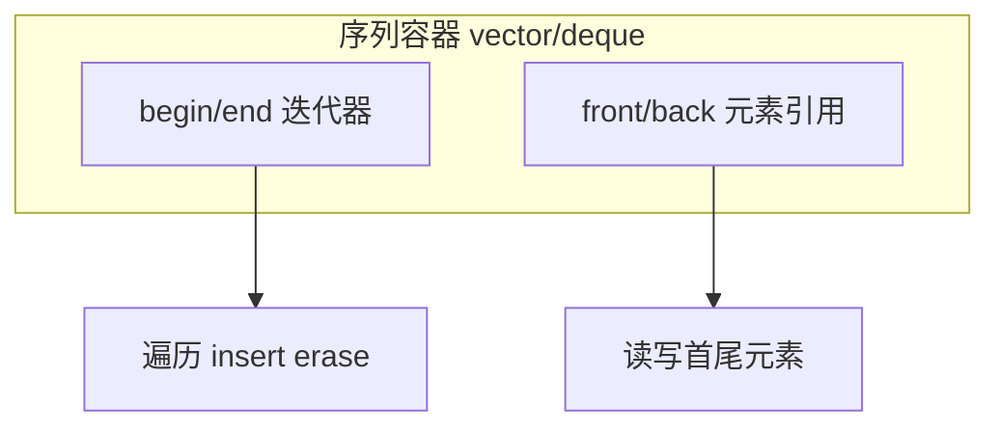

# Lightning Hooks 与 Callbacks

4 min read Aug 19, 2021

## Background — What and why of callbacks in framework(s)



```
mermaid

flowchart TB   subgraph seq ["序列容器 vector/deque"]     begin["begin/end 迭代器"]     front["front/back 元素引用"]   end   begin --> iterOps["遍历 insert erase"]   front --> elemOps["读写首尾元素"]
mermaid flowchart TB   subgraph seq ["序列容器 vector/deque"]     begin["begin/end 迭代器"]     front["front/back 元素引用"]   end   begin --> iterOps["遍历 insert erase"]   front --> elemOps["读写首尾元素"] One of the important part of a deep learning framework would be the balance between the ease of use and flexibility to change.
With ease of use, I like PyTorch Lightning for their rich features which already encapsulated in the core structure (flow) while one can control the run through config/settings (flags to Trainer object).
The simplified idea of a frameworks and position of callback is as follow:

# the extremely simplified high level structure of training loopfor epoch in epochs
 for batch in dataloader:

 model_output = model(x_in_batch)  loss = loss_function(target, model_output) loss.backward()  optimizer.step()  optimizer.zero_grad() Imagine what we need to do if we want to manipulate the batch, we can add code before passing it into model:
for epoch in epochs:
 for batch in dataloader:

 # Code add here to transform batch model_output = model(x_in_batch)  loss = loss_function(target, model_output) loss.backward()  optimizer.step()  optimizer.zero_grad() How the framework handle such flexibility for user to add their code without amending the function? The answer is callback (planned function calls at specific location) Assume a base class like below to have a on_batch_begin() to take in a batch and return a batch (default to be returning the same batch)
class BaseTrainer():
 def train(self):
 For epoch in epochs:
 For batch in dataloader:

 # calling callback that is at start of processing batch  batch = on_batch_begin(batch)  model_output = model(x_in_batch)  loss = loss_function(target, model_output) loss.backward()  optimizer.step()  optimizer.zero_grad()  def on_batch_begin(self, batch):
 # default to bypass and return the batch
 return batch Assume user want to amend the behavior, he/she can inherit the class and override the on_batch_begin():
class ChildTrainer(BaseTrainer):
 def on_batch_begin(self, batch):

 # Do some transform  new_batch = transform(batch)
 return new_batch

## How PyTorch Lightning approach the callback
For a full description and high level placement of all callbacks (hooks) available in PyTorch Lightning, the [documentation](https://pytorch-lightning.readthedocs.io/en/latest/common/lightning_module.html#hooks) gave a good detail.
Press enter or click to view image in full size


<p class="kb-image-caption">图例</p>

Screen capture of particular section in documentation A valid implementation (which I used to do) is something like:
class MyTrainer(pl.LightningModule):
 def on_epoch_end(self):

 # do some custom visualization for result of last epoch  ... # check if we should do early stop  ...
# check if we need to save check point of model
 ...

One can imagine if we override all the callback hooks, the Lightning Module itself can be huge and difficult to keep track.

## Get Stephen Cow Chau’s stories in your inbox
Join Medium for free to get updates from this writer.
Remember me for faster sign in So what PyTorch Lightning does is to include some Callback class, as for example above, they are already in the built-in call backs:
Press enter or click to view image in full size


<p class="kb-image-caption">图例</p>

The built-in callbacks, see [documentation](https://pytorch-lightning.readthedocs.io/en/stable/extensions/callbacks.html#built-in-callbacks) for more detail The official document have the following example:
Press enter or click to view image in full size


<p class="kb-image-caption">图例</p>

Note that the callbacks being pass to the Trainer is an array of Callback class instances, so one can separate different categories of actions into different callbacks.

## How is it being implemented in PyTorch Lightning
The core item I believe is several abstract class, for instance TrainerCallbackHookMixin for main training flow.
Press enter or click to view image in full size


<p class="kb-image-caption">图例</p>

This is in github project folder path: pytorch_lightning/trainer/callback_hook.py According to the code, whenever the main training flow call a particular planned hook, it would then loop through all the passed in callbacks to the Trainer instance.
And inside the main training flow, this is how the hook being called — by calling “call_hook()” function:
Press enter or click to view image in full size


<p class="kb-image-caption">图例</p>

This is in github project folder path: pytorch_lightning/loops/batch/training_batch_loop.py And the call_hook function is implemented as below, and note the highlighted region, and it “imply” it would call the callbacks before calling the overridden hook inside the PyTorch Lightning Module


<p class="kb-image-caption">图例</p>

This align with result observed — the message print from callback’s hook function before the hook overridden in PyTorch Lightning Module.


<p class="kb-image-caption">图例</p>
