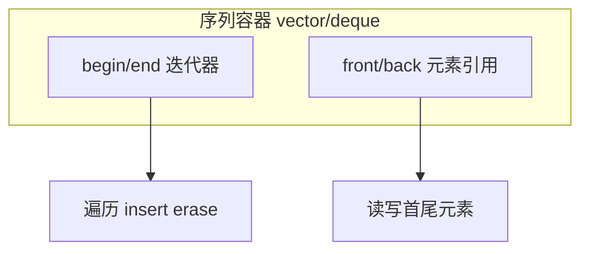

# PyTorch Lightning 完全攻略

## 写在前面
Pytorch-Lightning这个库我“发现”过两次。第一次发现时，感觉它很重很难学，而且似乎自己也用不上。但是后面随着做的项目开始出现了一些稍微高阶的要求，我发现我总是不断地在相似工程代码上花费大量时间，Debug也是这些代码花的时间最多，而且渐渐产生了一个矛盾之处：如果想要更多更好的功能，如TensorBoard支持，Early Stop，LR Scheduler，分布式训练，快速测试等，代码就无可避免地变得越来越长，看起来也越来越乱，同时核心的训练逻辑也渐渐被这些工程代码盖过。那么有没有更好的解决方案，甚至能一键解决所有这些问题呢？

于是我第二次发现了Pytorch-Lightning. 真香。但是问题还是来了。这个框架并没有因为香而变得更加易学。官网的教程很丰富，可以看出来开发者们在努力做了。但是很多相连的知识点都被分布在了不同的版块里，还有一些核心的理解要点并没有被强调出来，而是小字带过，这让我想做一个普惠的教程，包含所有我在学习过程中认为重要的概念，好用的参数，一些注意点, 坑点，大量的示例代码段和一些核心问题的集中讲解。最后，第三部分提供了一个我总结出来的易用于大型项目, 容易迁移, 易于复用的模板，有兴趣的可以去GitHub试用。
2023/08/18修改：在这几年的进一步使用中，由于这样那样的需求和问题，我发现了更多难以解决的问题/bug，所以又对Pytorch Lightning做了进一步的深入剖析。在”Pytorch Lightning 深入理解“一文中，针对hooks间的信息传递, Callbacks, DDP训练相关注意事项等又做了详细剖析。如果本文无法解决您的一些较为复杂的问题，不妨去这篇新文章看看，理解了hooks和Callbacks之后相信您可以自行写出各种能满足您个性化需求的方案。关于Pytorch DDP机制本身，如果你还不是很熟悉，或是需要对其中的深度机制进行进一步的理解，可以移步专门讲解这个问题的Pytorch DDP 剖析。

## 核心
-  Pytorch-Lighting 的一大特点是把模型和系统分开来看。模型是像Resnet18， RNN之类的纯模型， 而系统定义了一组模型如何相互交互，如GAN（生成器网络与判别器网络）, Seq2Seq（Encoder与Decoder网络）和Bert. 同时，有时候问题只涉及一个模型，那么这个系统则可以是一个通用的系统，用于描述模型如何使用，并可以被复用到很多其他项目。
-  Pytorch-Lighting 的核心设计思想是“自给自足”。每个网络也同时包含了如何训练, 如何测试, 优化器定义等内容。
## 推荐使用方法
这一部分放在最前面，因为全文内容太长，如果放后面容易忽略掉这部分精华。

Pytorch-Lightning 是一个很好的库，或者说是pytorch的抽象和包装。它的好处是可复用性强，易维护，逻辑清晰等。缺点也很明显，这个包需要学习和理解的内容还是挺多的，或者换句话说，很重。如果直接按照官方的模板写代码，小型project还好，如果是大型项目，有复数个需要调试验证的模型和数据集，那就不太好办，甚至更加麻烦了。经过几天的摸索和调试，我总结出了下面这样一套好用的模板，也可以说是对Pytorch-Lightning的进一步抽象。欢迎大家尝试这一套代码风格，如果用习惯的话还是相当方便复用的，也不容易半道退坑。
root-     |-data         |-__init__.py         |-data_interface.py         |-xxxdataset1.py         |-xxxdataset2.py         |-...
    |-model         |-__init__.py         |-model_interface.py         |-xxxmodel1.py         |-xxxmodel2.py         |-...
    |-main.py如果对每个模型直接上plmodule，对于已有项目, 别人的代码等的转换将相当耗时。另外，这样的话，你需要给每个模型都加上一些相似的代码，如`training_step`，`validation_step`。显然，这并不是我们想要的，如果真的这样做，不但不易于维护，反而可能会更加杂乱。同理，如果把每个数据集类都直接转换成pl的DataModule，也会面临相似的问题。基于这样的考量，我建议使用上述架构：
-  主目录下只放一个`main.py`文件。
- `data`和- `model`两个文件夹中放入- `__init__.py`文件，做成包。这样方便导入。两个- `init`文件分别是：
- `from .data_interface import DInterface`
- `from .model_interface import MInterface`
-  在`data_interface`中建立一个`class DInterface(pl.LightningDataModule):`用作所有数据集文件的接口。`__init__()`函数中import相应Dataset类，`setup()`进行实例化，并老老实实加入所需要的的`train_dataloader`, `val_dataloader`, `test_dataloader`函数。这些函数往往都是相似的，可以用几个输入args控制不同的部分。
-  同理，在`model_interface`中建立`class MInterface(pl.LightningModule):`类，作为模型的中间接口。`__init__()`函数中import相应模型类，然后老老实实加入`configure_optimizers`, `training_step`, `validation_step`等函数，用一个接口类控制所有模型。不同部分使用输入参数控制。
- `main.py`函数只负责：
- 定义parser，添加parse项。
- 选好需要的`callback`函数们。
- 实例化`MInterface`, `DInterface`, `Trainer`。完事。
*完全版模板可以在GitHub找到。*

## Lightning Module
### 简介
- 三个核心组件：
- 模型
- 优化器
- Train/Val/Test步骤
- 数据流伪代码：

outs = [] for batch in data:
    out = training_step(batch)     outs.append(out) training_epoch_end(outs)等价Lightning代码：
def training_step(self, batch, batch_idx):
    prediction = ...
    return prediction def training_epoch_end(self, training_step_outputs):
    for prediction in predictions:

        # do something with these我们需要做的，就是像填空一样，填这些函数。
### 组件与函数
- 一个Pytorch-Lighting 模型必须含有的部件是：
- `init`: 初始化，包括模型和系统的定义。
- `training_step(self, batch, batch_idx)`: 即每个batch的处理函数。参数：
- **batch**(- `Tensor`| (- `Tensor`, …) | [- `Tensor`, …]) – The output of your- `DataLoader`. A tensor, tuple or list.
- **batch_idx**(- *int*) – Integer displaying index of this batch
- **optimizer_idx**(- *int*) – When using multiple optimizers, this argument will also be present.
- **hiddens**(- `Tensor`) – Passed in if- `truncated_bptt_steps`> 0.

返回值：Any of.
- `Tensor`- The loss tensor
- `dict`- A dictionary. Can include any keys, but must include the key- `'loss'`
- `None`- Training will skip to the next batch

 返回值无论如何也需要有一个loss量。如果是字典，要有这个key. 没loss这个batch就被跳过了。例：
    x, y, z = batch     out = self.encoder(x)     loss = self.loss(out, x)
    return loss

# Multiple optimizers (e.g.: GANs)
def training_step(self, batch, batch_idx, optimizer_idx):
    if optimizer_idx == 0:

        # do training_step with encoder     if optimizer_idx == 1:
        # do training_step with decoder
# Truncated back-propagation through time
def training_step(self, batch, batch_idx, hiddens):

    # hiddens are the hidden states from the previous truncated backprop step     ...
    out, hiddens = self.lstm(data, hiddens)     ...
    return {'loss': loss, 'hiddens': hiddens} `configure_optimizers`: 优化器定义，返回一个优化器，或数个优化器，或两个List（优化器，Scheduler）。如：

# most cases
def configure_optimizers(self):
    opt = Adam(self.parameters(), lr=1e-3)
    return opt

# multiple optimizer case (e.g.: GAN)
    generator_opt = Adam(self.model_gen.parameters(), lr=0.01)     disriminator_opt = Adam(self.model_disc.parameters(), lr=0.02)
    return generator_opt, disriminator_opt

# example with learning rate schedulers
    generator_opt = Adam(self.model_gen.parameters(), lr=0.01)     disriminator_opt = Adam(self.model_disc.parameters(), lr=0.02)     discriminator_sched = CosineAnnealing(discriminator_opt, T_max=10)
    return [generator_opt, disriminator_opt], [discriminator_sched]

# example with step-based learning rate schedulers
    gen_opt = Adam(self.model_gen.parameters(), lr=0.01)     dis_opt = Adam(self.model_disc.parameters(), lr=0.02)     gen_sched = {'scheduler': ExponentialLR(gen_opt, 0.99), 'interval': 'step'}  # called after each training step     dis_sched = CosineAnnealing(discriminator_opt, T_max=10) # called every epoch
    return [gen_opt, dis_opt], [gen_sched, dis_sched]

# example with optimizer frequencies
# see training procedure in `Improved Training of Wasserstein GANs`, Algorithm 1
# https://arxiv.org/abs/1704.00028
    gen_opt = Adam(self.model_gen.parameters(), lr=0.01)     dis_opt = Adam(self.model_disc.parameters(), lr=0.02)     n_critic = 5
    return (
        {'optimizer': dis_opt, 'frequency': n_critic},
        {'optimizer': gen_opt, 'frequency': 1}     )
- 可以指定的部件有：
- `forward`: 和正常的- `nn.Module`一样，用于inference. 内部调用时：- `y=self(batch)`
- `training_step_end`: 只在使用多个node进行训练且结果涉及如softmax之类需要全部输出联合运算的步骤时使用该函数。同理，- `validation_step_end`/- `test_step_end`。
- `training_epoch_end`:
- 在一个训练epoch结尾处被调用。
- 输入参数：一个List，List的内容是前面`training_step()`所返回的每次的内容。
- 返回：None
- `validation_step(self, batch, batch_idx)`/- `test_step(self, batch, batch_idx)`:
- 没有返回值限制，不一定非要输出一个`val_loss`。
- `validation_epoch_end`/- `test_epoch_end`
- 工具函数有：
- `freeze`：冻结所有权重以供预测时候使用。仅当已经训练完成且后面只测试时使用。
- `print`：尽管自带的- `print`函数也可以使用，但如果程序运行在分布式系统时，会打印多次。而使用- `self.print()`则只会打印一次。
- `log`：像是TensorBoard等log记录器，对于每个log的标量，都会有一个相对应的横坐标，它可能是batch number或epoch number. 而- `on_step`就表示把这个log出去的量的横坐标表示为当前batch，而- `on_epoch`则表示将log的量在整个epoch上进行累积后log，横坐标为当前epoch.

| LightningMoule Hook | on_step | on_epoch | prog_bar | logger |
| --- | --- | --- | --- | --- |
| training_step | T | F | F | T |
| training_step_end | T | F | F | T |
| training_epoch_end | F | T | F | T |
| validation_step- *| F | T | F | T |
| validation_step_end*| F | T | F | T |
| validation_epoch_end* | F | T | F | T |

- `*`also applies to the test loop参数name(`str`) – key namevalue(`Any`) – value nameprog_bar(`bool`) – if True logs to the progress barlogger(`bool`) – if True logs to the loggeron_step(`Optional`[`bool`]) – if True logs at this step. None auto-logs at the training_step but not validation/test_stepon_epoch(`Optional`[`bool`]) – if True logs epoch accumulated metrics. None auto-logs at the val/test step but not training_stepreduce_fx(`Callable`) – reduction function over step values for end of epoch. Torch.mean by defaulttbptt_reduce_fx(`Callable`) – function to reduce on truncated back proptbptt_pad_token(`int`) – token to use for paddingenable_graph(`bool`) – if True, will not auto detach the graphsync_dist(`bool`) – if True, reduces the metric across GPUs/TPUssync_dist_op(`Union`[`Any`, `str`]) – the op to sync across GPUs/TPUssync_dist_group(`Optional`[`Any`]) – the ddp group |
- `log_dict`：和- `log`函数唯一的区别就是，- `name`和- `value`变量由一个字典替换。表示同时log多个值。如：
 - `python values = {'loss': loss, 'acc': acc, ..., 'metric_n': metric_n} self.log_dict(values)`
- `save_hyperparameters`：储存- `init`中输入的所有超参。后续访问可以由- `self.hparams.argX`方式进行。同时，超参表也会被存到文件中。
- 函数内建变量：
- `device`：可以使用- `self.device`来构建设备无关型tensor. 如：- `z = torch.rand(2, 3, device=self.device)`。
- `hparams`：含有所有前面存下来的输入超参。
- `precision`：精确度。常见32和16.
### 要点
- 如果准备使用DataParallel，在写`training_step`的时候需要调用forward函数，`z=self(x)`
### 模板
class LitModel(pl.LightningModule):
    def __init__(...):
    def forward(...):
    def training_step(...)     def training_step_end(...)     def training_epoch_end(...)     def validation_step(...)     def validation_step_end(...)     def validation_epoch_end(...)     def test_step(...)     def test_step_end(...)     def test_epoch_end(...)     def configure_optimizers(...)     def any_extra_hook(...)

## Trainer
### 基础使用
model = MyLightningModule() trainer = Trainer() trainer.fit(model, train_dataloader, val_dataloader)如果连`validation_step`都没有，那`val_dataloader`也就算了。

### 伪代码与hooks
def fit(...):
    on_fit_start()     if global_rank == 0:

        # prepare data is called on GLOBAL_ZERO only         prepare_data()     for gpu/tpu in gpu/tpus:
        train_on_device(model.copy())     on_fit_end() def train_on_device(model):

    # setup is called PER DEVICE     setup()     configure_optimizers()     on_pretrain_routine_start()     for epoch in epochs:
        train_loop()     teardown() def train_loop():
    on_train_epoch_start()     train_outs = []     for train_batch in train_dataloader():
        on_train_batch_start()         # ----- train_step methods -------         out = training_step(batch)         train_outs.append(out)         loss = out.loss         backward()         on_after_backward()         optimizer_step()         on_before_zero_grad()         optimizer_zero_grad()         on_train_batch_end(out)         if should_check_val:
            val_loop()     # end training epoch     logs = training_epoch_end(outs) def val_loop():
    model.eval()     torch.set_grad_enabled(False)     on_validation_epoch_start()     val_outs = []     for val_batch in val_dataloader():
        on_validation_batch_start()         # -------- val step methods -------         out = validation_step(val_batch)         val_outs.append(out)         on_validation_batch_end(out)     validation_epoch_end(val_outs)     on_validation_epoch_end()     # set up for train     model.train()     torch.set_grad_enabled(True)

### 推荐参数
- `default_root_dir`：默认存储地址。所有的实验变量和权重全部会被存到这个文件夹里面。推荐是，每个模型有一个独立的文件夹。每次重新训练会产生一个新的- `version_x`子文件夹。
- `max_epochs`：最大训练周期数。- `trainer = Trainer(max_epochs=1000)`
- `min_epochs`：至少训练周期数。当有Early Stop时使用。
- `auto_scale_batch_size`：在进行任何训练前自动选择合适的batch size.
# default used by the Trainer (no scaling of batch size)
trainer = Trainer(auto_scale_batch_size=None)

# run batch size scaling, result overrides hparams.batch_size
trainer = Trainer(auto_scale_batch_size='binsearch')

# call tune to find the batch size
trainer.tune(model)
- `auto_select_gpus`：自动选择合适的GPU. 尤其是在有GPU处于独占模式时候，非常有用。
- `auto_lr_find`：自动找到合适的初始学习率。使用了该论文的技术。当且仅当执行- `trainer.tune(model)`代码时工作。
# run learning rate finder, results override hparams.learning_rate
trainer = Trainer(auto_lr_find=True)

# run learning rate finder, results override hparams.my_lr_arg
trainer = Trainer(auto_lr_find='my_lr_arg')

# call tune to find the lr
trainer.tune(model)
- `precision`：精确度。正常是32，使用16可以减小内存消耗，增大batch.
# default used by the Trainer
trainer = Trainer(precision=32)

# 16-bit precision
trainer = Trainer(precision=16, gpus=1)
- `val_check_interval`：进行Validation测试的周期。正常为1，训练1个epoch测试4次是0.25，每1000 batch测试一次是1000.

use (float) to check within a training epoch：此时这个值为一个epoch的百分比。每百分之多少测试一次。
use (int) to check every n steps (batches)：每多少个batch测试一次。

# default used by the Trainer
trainer = Trainer(val_check_interval=1.0)

# check validation set 4 times during a training epoch
trainer = Trainer(val_check_interval=0.25)

# check validation set every 1000 training batches
# use this when using iterableDataset and your dataset has no length
# (ie: production cases with streaming data)
trainer = Trainer(val_check_interval=1000)
- `gpus`：控制使用的GPU数。当设定为None时，使用cpu.
# default used by the Trainer (ie: train on CPU)
trainer = Trainer(gpus=None)

# equivalent
trainer = Trainer(gpus=0)

# int: train on 2 gpus
trainer = Trainer(gpus=2)

# list: train on GPUs 1, 4 (by bus ordering)
trainer = Trainer(gpus=[1, 4]) trainer = Trainer(gpus='1, 4') # equivalent

# -1: train on all gpus
trainer = Trainer(gpus=-1) trainer = Trainer(gpus='-1') # equivalent

# combine with num_nodes to train on multiple GPUs across nodes
# uses 8 gpus in total
trainer = Trainer(gpus=2, num_nodes=4)

# train only on GPUs 1 and 4 across nodes
trainer = Trainer(gpus=[1, 4], num_nodes=4)
- `limit_train_batches`：使用训练数据的百分比。如果数据过多，或正在调试，可以使用这个。值的范围为0~1. 同样，有- `limit_test_batches`，- `limit_val_batches`。
# default used by the Trainer
trainer = Trainer(limit_train_batches=1.0)

# run through only 25% of the training set each epoch
trainer = Trainer(limit_train_batches=0.25)

# run through only 10 batches of the training set each epoch
trainer = Trainer(limit_train_batches=10)
- `fast_dev_run`：bool量。如果设定为true，会只执行一个batch的train, val 和 test，然后结束。仅用于debug.

`Setting this argument will disable tuner, checkpoint callbacks, early stopping callbacks, loggers and logger callbacks like LearningRateLogger and runs for only 1 epoch.`

# default used by the Trainer
trainer = Trainer(fast_dev_run=False)

# runs 1 train, val, test batch and program ends
trainer = Trainer(fast_dev_run=True)

# runs 7 train, val, test batches and program ends
trainer = Trainer(fast_dev_run=7)

### .fit()函数
`Trainer.fit(model, train_dataloader=None, val_dataloaders=None, datamodule=None)`：输入第一个量一定是model，然后可以跟一个LigntningDataModule或一个普通的Train DataLoader. 如果定义了Val step，也要有Val DataLoader.

参数datamodule(Optional[LightningDataModule]) – A instance of LightningDataModule.model(LightningModule) – Model to fit.train_dataloader(Optional[DataLoader]) – A Pytorch DataLoader with training samples. If the model has a predefined train_dataloader method this will be skipped.val_dataloaders(Union[DataLoader, List[DataLoader], None]) – Either a single Pytorch Dataloader or a list of them, specifying validation samples. If the model has a predefined val_dataloaders method this will be skipped

### 其他要点
- `.test()`若非直接调用，不会运行。- `trainer.test()`
- `.test()`会自动load最优模型。
- `model.eval()`and- `torch.no_grad()`在进行测试时会被自动调用。
- 默认情况下，`Trainer()`运行于CPU上。
### 使用样例
- 手动添加命令行参数：

from argparse import ArgumentParser def main(hparams):
    model = LightningModule()     trainer = Trainer(gpus=hparams.gpus)     trainer.fit(model) if __name__ == '__main__':
    parser = ArgumentParser()     parser.add_argument('--gpus', default=None)     args = parser.parse_args()     main(args)
- 自动添加所有`Trainer`会用到的命令行参数：

from argparse import ArgumentParser def main(args):
    model = LightningModule()     trainer = Trainer.from_argparse_args(args)     trainer.fit(model) if __name__ == '__main__':
    parser = ArgumentParser()     parser = Trainer.add_argparse_args(         # group the Trainer arguments together         parser.add_argument_group(title="pl.Trainer args")     )     args = parser.parse_args()     main(args)
- 混合式，既使用`Trainer`相关参数，又使用一些自定义参数，如各种模型超参：

from argparse import ArgumentParser import pytorch_lightning as pl from pytorch_lightning import LightningModule, Trainer def main(args):
    parser = ArgumentParser()     parser.add_argument('--batch_size', default=32, type=int)     parser.add_argument('--hidden_dim', type=int, default=128)     parser = Trainer.add_argparse_args(         # group the Trainer arguments together         parser.add_argument_group(title="pl.Trainer args")     )     args = parser.parse_args()     main(args)

### 所有参数
`Trainer.``__init__`(logger=True, checkpoint_callback=True, callbacks=None, default_root_dir=None, gradient_clip_val=0, process_position=0, num_nodes=1, num_processes=1, gpus=None, auto_select_gpus=False, tpu_cores=None, log_gpu_memory=None, progress_bar_refresh_rate=None, overfit_batches=0.0, track_grad_norm=- 1, check_val_every_n_epoch=1, fast_dev_run=False, accumulate_grad_batches=1, max_epochs=None, min_epochs=None, max_steps=None, min_steps=None, limit_train_batches=1.0, limit_val_batches=1.0, limit_test_batches=1.0, limit_predict_batches=1.0, val_check_interval=1.0, flush_logs_every_n_steps=100, log_every_n_steps=50, accelerator=None, sync_batchnorm=False, precision=32, weights_summary='top', weights_save_path=None, num_sanity_val_steps=2, truncated_bptt_steps=None, resume_from_checkpoint=None, profiler=None, benchmark=False, deterministic=False, reload_dataloaders_every_epoch=False, auto_lr_find=False, replace_sampler_ddp=True, terminate_on_nan=False, auto_scale_batch_size=False, prepare_data_per_node=True, plugins=None, amp_backend='native', amp_level='O2', distributed_backend=None, move_metrics_to_cpu=False, multiple_trainloader_mode='max_size_cycle', stochastic_weight_avg=False)

### Log和return loss到底在做什么
To add a training loop use the training_step method
class LitClassifier(pl.LightningModule):
     def __init__(self, model):
         super().__init__()          self.model = model      def training_step(self, batch, batch_idx):
         x, y = batch          y_hat = self.model(x)          loss = F.cross_entropy(y_hat, y)
         return loss
- 无论是`training_step`，还是`validation_step`，`test_step`返回值都是`loss`。返回的loss会被用一个list收集起来。

Under the hood, Lightning does the following (pseudocode):

# put model in train mode
model.train() torch.set_grad_enabled(True) losses = [] for batch in train_dataloader:

    # forward     loss = training_step(batch)     losses.append(loss.detach())     # backward     loss.backward()     # apply and clear grads     optimizer.step()     optimizer.zero_grad()
### Training epoch-level metrics
If you want to calculate epoch-level metrics and log them, use the `.log` method     x, y = batch     y_hat = self.model(x)     loss = F.cross_entropy(y_hat, y)     # logs metrics for each training_step, # and the average across the epoch, to the progress bar and logger     self.log('train_loss', loss, on_step=True, on_epoch=True, prog_bar=True, logger=True)
    return loss
- 如果在`x_step`函数中使用了`.log()`函数，那么这个量将会被逐步记录下来。每一个`log`出去的变量都会被记录下来，每一个`step`会集中生成一个字典dict，而每个epoch都会把这些字典收集起来，形成一个字典的list.

The .log object automatically reduces the requested metrics across the full epoch. Here’s the pseudocode of what it does under the hood:
outs = [] for batch in train_dataloader:

    # forward     out = training_step(val_batch)     # backward     loss.backward()     # apply and clear grads     optimizer.step()     optimizer.zero_grad() epoch_metric = torch.mean(torch.stack([x['train_loss'] for x in outs]))
### Train epoch-level operations
If you need to do something with all the outputs of each training_step, override training_epoch_end yourself.
    x, y = batch     y_hat = self.model(x)     loss = F.cross_entropy(y_hat, y)     preds = ...
    return {'loss': loss, 'other_stuff': preds} def training_epoch_end(self, training_step_outputs):
   for pred in training_step_outputs:

       # do something The matching pseudocode is:
    # forward     out = training_step(val_batch)     # backward     loss.backward()     # apply and clear grads     optimizer.step()     optimizer.zero_grad() training_epoch_end(outs)
## DataModule
### 介绍
-  首先，这个`DataModule`和之前写的Dataset完全不冲突。前者是后者的一个包装，并且这个包装可以被用于多个torch Dataset 中。在我看来，其最大的作用就是把各种train/val/test划分, DataLoader初始化之类的重复代码通过包装类的方式得以被简单的复用。
- 具体作用项目：
- Download instructions：下载
- Processing instructions：处理
- Split instructions：分割
- Train dataloader：训练集Dataloader
- Val dataloader(s)：验证集Dataloader
- Test dataloader(s)：测试集Dataloader
-  其次，`pl.LightningDataModule`相当于一个功能加强版的torch Dataset，加强的功能包括：
- `prepare_data(self)`：
- 最最开始的时候，进行一些无论GPU有多少只要执行一次的操作，如写入磁盘的下载操作, 分词操作(tokenize)等。
- 这里是一劳永逸式准备数据的函数。
- 由于只在单线程中调用，不要在这个函数中进行`self.x=y`似的赋值操作。
- 但如果是自己用而不是给大众分发的话，这个函数可能并不需要调用，因为数据提前处理好就好了。
- `setup(self, stage=None)`：
- 实例化数据集（Dataset），并进行相关操作，如：清点类数，划分train/val/test集合等。
- 参数`stage`用于指示是处于训练周期(`fit`)还是测试周期(`test`)，其中，`fit`周期需要构建train和val两者的数据集。
- setup函数不需要返回值。初始化好的train/val/test set直接赋值给self即可。
- `train_dataloader/val_dataloader/test_dataloader`：
- 初始化`DataLoader`。
- 返回一个DataLoader量。
### 示例
class MNISTDataModule(pl.LightningDataModule):
    def __init__(self, data_dir: str = './', batch_size: int = 64, num_workers: int = 8):
        super().__init__()         self.data_dir = data_dir         self.batch_size = batch_size         self.num_workers = num_workers         self.transform = transforms.Compose([             transforms.ToTensor(), transforms.Normalize((0.1307, ), (0.3081, ))         ])         # self.dims is returned when you call dm.size()         # Setting default dims here because we know them.

        # Could optionally be assigned dynamically in dm.setup()         self.dims = (1, 28, 28)         self.num_classes = 10     def prepare_data(self):
        # download         MNIST(self.data_dir, train=True, download=True)         MNIST(self.data_dir, train=False, download=True)     def setup(self, stage=None):
        # Assign train/val datasets for use in dataloaders         if stage == 'fit' or stage is None:
            mnist_full = MNIST(self.data_dir, train=True, transform=self.transform)             self.mnist_train, self.mnist_val = random_split(mnist_full, [55000, 5000])         # Assign test dataset for use in dataloader(s)         if stage == 'test' or stage is None:
            self.mnist_test = MNIST(self.data_dir, train=False, transform=self.transform)     def train_dataloader(self):
        return DataLoader(self.mnist_train, batch_size=self.batch_size, num_workers=self.num_workers)     def val_dataloader(self):
        return DataLoader(self.mnist_val, batch_size=self.batch_size, num_workers=self.num_workers)     def test_dataloader(self):
        return DataLoader(self.mnist_test, batch_size=self.batch_size, num_workers=self.num_workers)

### 要点
- 若在DataModule中定义了一个`self.dims`变量，后面可以调用`dm.size()`获取该变量。
## Saving and Loading
### Saving
- ModelCheckpoint: 自动储存的callback module. 默认情况下training过程中只会自动储存最新的模型与相关参数，而用户可以通过这个module自定义。如观测一个`val_loss`的量，并储存top 3好的模型，且同时储存最后一个epoch的模型，等等。例：

from pytorch_lightning.callbacks import ModelCheckpoint

# saves a file like: my/path/sample-mnist-epoch=02-val_loss=0.32.ckpt
checkpoint_callback = ModelCheckpoint(     monitor='val_loss', filename='sample-mnist-{epoch:02d}-{val_loss:.2f}', save_top_k=3, mode='min', save_last=True ) trainer = pl.Trainer(gpus=1, max_epochs=3, progress_bar_refresh_rate=20, callbacks=[checkpoint_callback])
- 另外，也可以手动存储checkpoint: `trainer.save_checkpoint("example.ckpt")`
- `ModelCheckpoint`Callback中，如果- `save_weights_only =True`，那么将会只储存模型的权重（相当于- `model.save_weights(filepath)`），反之会储存整个模型（相当于- `model.save(filepath)`）。
### Loading
- load一个模型，包括它的weights, biases和超参数：

model = MyLightingModule.load_from_checkpoint(PATH) print(model.learning_rate)

# prints the learning_rate you used in this checkpoint
model.eval() y_hat = model(x) load模型时替换一些超参数：
class LitModel(LightningModule):
    def __init__(self, in_dim, out_dim):
      super().__init__()       self.save_hyperparameters()       self.l1 = nn.Linear(self.hparams.in_dim, self.hparams.out_dim)

# if you train and save the model like this it will use these values when loading
# the weights. But you can overwrite this
LitModel(in_dim=32, out_dim=10)

# uses in_dim=32, out_dim=10
model = LitModel.load_from_checkpoint(PATH)

# uses in_dim=128, out_dim=10
model = LitModel.load_from_checkpoint(PATH, in_dim=128, out_dim=10)
- 完全load训练状态：load包括模型的一切，以及和训练相关的一切参数，如`model, epoch, step, LR schedulers, apex`等

model = LitModel() trainer = Trainer(resume_from_checkpoint='some/path/to/my_checkpoint.ckpt')

# automatically restores model, epoch, step, LR schedulers, apex, etc...
trainer.fit(model)

## Callbacks



```
mermaid
flowchart TB   subgraph seq ["序列容器 vector/deque"]     begin["begin/end 迭代器"]     front["front/back 元素引用"]   end   begin --> iterOps["遍历 insert erase"]   front --> elemOps["读写首尾元素"]
mermaid flowchart TB   subgraph seq ["序列容器 vector/deque"]     begin["begin/end 迭代器"]     front["front/back 元素引用"]   end   begin --> iterOps["遍历 insert erase"]   front --> elemOps["读写首尾元素"] mermaid flowchart TB   subgraph seq ["序列容器 vector/deque"]     begin["begin/end 迭代器"]     front["front/back 元素引用"]   end   begin --> iterOps["遍历 insert erase"]   front --> elemOps["读写首尾元素"]
- Callback 是一个自包含的程序，可以与训练流程交织在一起，而不会污染主要的研究逻辑。
- Callback 并非只会在epoch结尾调用。pytorch-lightning 提供了数十个hook（接口，调用位置）可供选择，也可以自定义callback，实现任何想实现的模块。
- 推荐使用方式是，随问题和项目变化的操作，这些函数写到lightning module里面，而相对独立，相对辅助性的，需要复用的内容则可以定义单独的模块，供后续方便地插拔使用。
### Callbacks推荐
- `EarlyStopping(monitor='early_stop_on', min_delta=0.0, patience=3, verbose=False, mode='min', strict=True)`：根据某个值，在数个epoch没有提升的情况下提前停止训练。参数：
monitor(str) – quantity to be monitored. Default: 'early_stop_on'.min_delta(float) – minimum change in the monitored quantity to qualify as an improvement, i.e. an absolute change of less than min_delta, will count as no improvement. Default: 0.0.patience(int) – number of validation epochs with no improvement after which training will be stopped. Default: 3.verbose(bool) – verbosity mode. Default: False.mode(str) – one of 'min', 'max'. In 'min' mode, training will stop when the quantity monitored has stopped decreasing and in 'max' mode it will stop when the quantity monitored has stopped increasing.strict(bool) – whether to crash the training if monitor is not found in the validation metrics. Default: True.
示例：
from pytorch_lightning import Trainer from pytorch_lightning.callbacks import EarlyStopping early_stopping = EarlyStopping('val_loss') trainer = Trainer(callbacks=[early_stopping])
- `ModelCheckpoint`：见上文- **Saving and Loading**.
- `PrintTableMetricsCallback`：在每个epoch结束后打印一份结果整理表格。
from pl_bolts.callbacks import PrintTableMetricsCallback callback = PrintTableMetricsCallback() trainer = pl.Trainer(callbacks=[callback]) trainer.fit(...)

# ------------------------------
# at the end of every epoch it will print
# loss│train_loss│val_loss│epoch
# ──────────────────────────────
# 2.2541470527648926│2.2541470527648926│2.2158432006835938│0
## Logging
from pytorch_lightning import loggers as pl_loggers

# Default
tb_logger = pl_loggers.TensorBoardLogger(     save_dir=os.getcwd(), version=None, name='lightning_logs'
) trainer = Trainer(logger=tb_logger)

# Or use the same format as others
tb_logger = pl_loggers.TensorBoardLogger('logs/')

# One Logger
comet_logger = pl_loggers.CometLogger(save_dir='logs/') trainer = Trainer(logger=comet_logger)

# Save code snapshot
logger = pl_loggers.TestTubeLogger('logs/', create_git_tag=True)

# Multiple Logger
tb_logger = pl_loggers.TensorBoardLogger('logs/') comet_logger = pl_loggers.CometLogger(save_dir='logs/') trainer = Trainer(logger=[tb_logger, comet_logger])默认情况下，每50个batch log一次，可以通过调整参数
- 如果想要log输出非scalar（标量）的内容，如图片，文本，直方图等等，可以直接调用`self.logger.experiment.add_xxx()`来实现所需操作。
def training_step(...):
    ...

    # the logger you used (in this case tensorboard)     tensorboard = self.logger.experiment     tensorboard.add_image()     tensorboard.add_histogram(...)     tensorboard.add_figure(...)
- 使用log：如果是TensorBoard，那么：`tensorboard --logdir ./lightning_logs`。在Jupyter Notebook中，可以使用：
# Start tensorboard.
%load_ext tensorboard %tensorboard --logdir lightning_logs/在行内打开TensorBoard.
- 小技巧：如果在局域网内开启了TensorBoard，加上flag `--bind_all`即可使用主机名访问：
`tensorboard --logdir lightning_logs --bind_all` -> `http://SERVER-NAME:6006/`

## Transfer Learning
import torchvision.models as models
class ImagenetTransferLearning(LightningModule):
    def __init__(self):
        super().__init__()         # init a pretrained resnet         backbone = models.resnet50(pretrained=True)         num_filters = backbone.fc.in_features         layers = list(backbone.children())[:-1]         self.feature_extractor = nn.Sequential(*layers)         # use the pretrained model to classify cifar-10 (10 image classes)         num_target_classes = 10         self.classifier = nn.Linear(num_filters, num_target_classes)     def forward(self, x):
        self.feature_extractor.eval()         with torch.no_grad():
            representations = self.feature_extractor(x).flatten(1)         x = self.classifier(representations)         ...

## 关于device操作
LightningModules know what device they are on! Construct tensors on the device directly to avoid CPU->Device transfer.

# bad
t = torch.rand(2, 2).cuda()

# good (self is LightningModule)
t = torch.rand(2, 2, device=self.device) For tensors that need to be model attributes, it is best practice to register them as buffers in the modules’ `__init__` method:

# bad
self.t = torch.rand(2, 2, device=self.device)

# good
self.register_buffer("t", torch.rand(2, 2))前面两段是教程中的文本。然而实际上有一个暗坑：
如果你使用了一个中继的`pl.LightningModule`，而这个module里面实例化了某个普通的`nn.Module`，而这个模型中又需要内部生成一些tensor，比如图片每个通道的mean，std之类，那么如果你从`pl.LightningModule`中pass一个`self.device`，实际上在一开始这个`self.device`永远是`cpu`。所以如果你在调用的`nn.Module`的`__init__()`中初始化，使用`to(device)`或干脆什么都不用，结果就是它永远都在`cpu`上。但是，经过实验，虽然`pl.LightningModule`在`__init__()`阶段`self.device`还是`cpu`，当进入了`training_step()`之后，就迅速变为了`cuda`。所以，对于子模块，最佳方案是，使用一个`forward`中传入的量，如`x`，作为一个reference变量，用`type_as`函数将在模型中生成的tensor都放到和这个参考变量相同的device上即可。
class RDNFuse(nn.Module):
    ...
    def init_norm_func(self, ref):
        self.mean = torch.tensor(np.array(self.mean_sen), dtype=torch.float32).type_as(ref)     def forward(self, x):
        if not hasattr(self, 'mean'):
            self.init_norm_func(x)

## Points
- `pl.seed_everything(1234)`：对所有相关的随机量固定种子。
-  使用LR Scheduler时候，不用自己`.step()`。它也被Trainer自动处理了。Optimization 主页面
# Single optimizer
for epoch in epochs:
    for batch in data:
        loss = model.training_step(batch, batch_idx, ...)         loss.backward()         optimizer.step()         optimizer.zero_grad()     for scheduler in schedulers:
        scheduler.step()

# Multiple optimizers
for epoch in epochs:
  for batch in data:
     for opt in optimizers:
        disable_grads_for_other_optimizers()         train_step(opt)         opt.step()   for scheduler in schedulers:
     scheduler.step()
-  关于划分train和val集合的方法。与PL无关，但很常用，两个例子：
- `random_split(range(10), [3, 7], generator=torch.Generator().manual_seed(42))`
- 如下：
from torch.utils.data import DataLoader, random_split from torchvision.datasets import MNIST mnist_full = MNIST(self.data_dir, train=True, transform=self.transform) self.mnist_train, self.mnist_val = random_split(mnist_full, [55000, 5000]) Parameters：dataset(Dataset) – Dataset to be splitlengths(sequence) – lengths of splits to be producedgenerator(Generator) – Generator used for the random permutation.

## 相关笔记

[深度学习与AI（主题索引）](../../../../index/MOC-dl-ai.md)
[[PyTorch-Lightning-完全攻略-zh|PyTorch Lightning 完全攻略]]
[[Lightning-Bolts-学习率调度|Lightning Bolts 学习率调度]]
[[Lightning-Bolts-学习率调度|Lightning Bolts 学习率调度]]
[[Lightning-Bolts-工具箱|Lightning Bolts 工具箱]]
[[Lightning-Hooks-与-Callbacks|Lightning Hooks 与 Callbacks]]
[[Lightning-Hooks-与-Callbacks|Lightning Hooks 与 Callbacks]]
[[CosineAnnealingLR-余弦退火|CosineAnnealingLR 余弦退火]]
[[ReduceLROnPlateau-学习率调度|ReduceLROnPlateau 学习率调度]]
